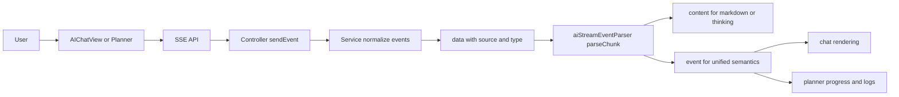
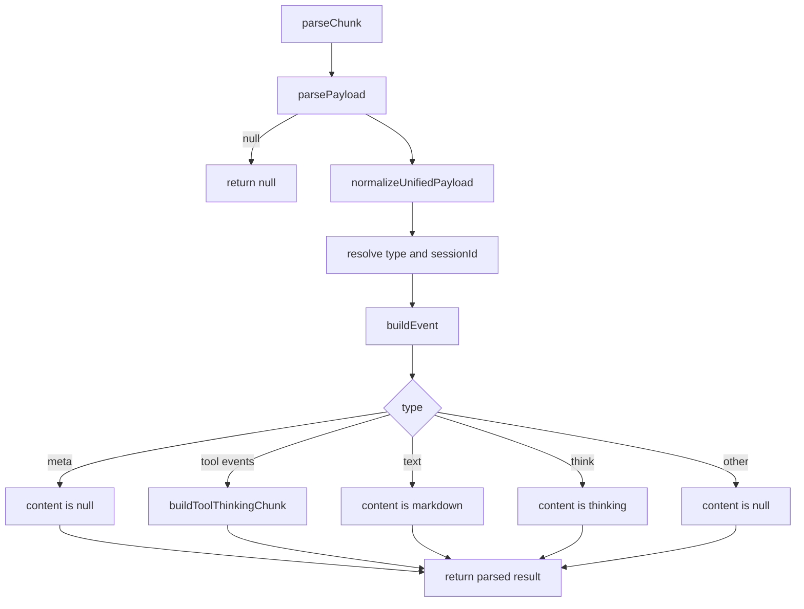
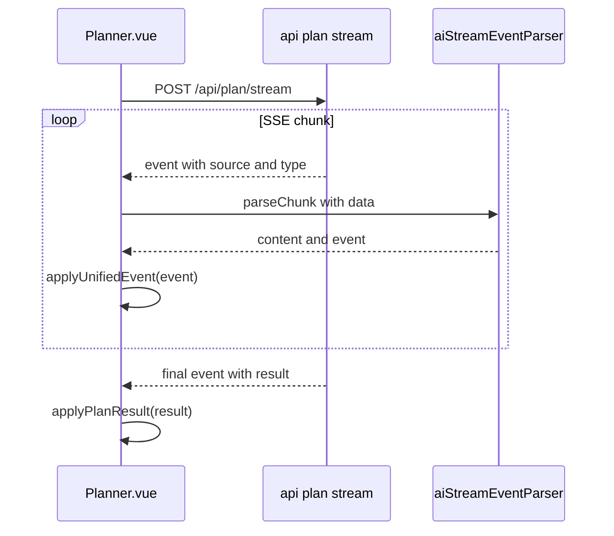

# AI 统一流式事件协议与解析实现说明（v1）

## 1. 文档定位

这不是“字段清单”文档，而是“实现设计 + 落地说明”文档，回答三个问题：

1. 协议到底统一成什么样（字段、类型、约束）。
2. 前端 parser 是怎么一步步工作的。
3. `planService` 与 `aiChatService` 改了什么、为什么这样改。

适用范围：

- `POST /api/ai-chat`（SSE）
- `POST /api/plan/stream`（SSE）
- 前端统一解析器 `frontend/src/utils/aiStreamEventParser.js`

---

## 2. 改造背景与目标

改造前存在两个核心问题：

1. `chat` 与 `plan` 的流式事件语义不同，前端需要两套解析逻辑。
2. 工具返回摘要在部分场景（例如地图 POI 搜索）会出现“原始 JSON 片段直出”，可读性差。

本次重构目标：

- 统一事件主语义到 `source + type`。
- 前端统一走 `parseChunk`，`Planner` 不再依赖旧规划事件结构。
- 工具摘要默认展示“提炼后信息”，而非大段 JSON。

---

## 3. 协议总览

所有流式 `data:` 负载必须是对象，并至少具备：

```json
{
  "source": "chat | plan",
  "type": "meta | text | think | tool_call | tool_result | tool_error | final | error | ping"
}
```

常见扩展字段：

- `sessionId`: 会话 ID（chat 侧常用）
- `phase`: 阶段（如 `tooling` / `synthesis`）
- `content`: 文本或规范化内容
- `summary`: 可展示摘要（工具事件）
- `rawContent`: 原始工具返回片段（用于 debug）
- `toolName` / `toolCallId`: 工具标识
- `tools`: 可用工具列表（meta）
- `result`: 终态结果（final）
- `message`: 错误文本（error）

---

## 4. 端到端链路（统一后）



关键点：

- `content` 是“渲染层产物”。
- `event` 是“业务层产物”。
- 同一 `parseChunk` 同时服务两类消费方。

---

## 5. Parser 工作流程（重点）

文件：`frontend/src/utils/aiStreamEventParser.js`

`parseChunk(chunk)` 的职责是把各种上游数据压平为统一语义对象。

### 5.1 流程图



### 5.2 分阶段说明

1. `parsePayload`
- 输入可能是对象或字符串。
- 字符串尝试 `JSON.parse`，失败则按 `{ content: raw }` 处理。

2. `normalizeUnifiedPayload`
- 确保 payload 有 `type`。
- 当前允许自动推断：
  - `tools[] -> meta`
  - `result -> final`
  - `message -> error`
  - `content(string) -> text`

3. `buildEvent`
- 统一产出 `event`，包含 `source/type/phase`。
- 对工具类事件补齐：`toolName/toolCallId/summary/content/rawContent`。

4. `buildToolThinkingChunk`
- 专门给聊天 UI 的折叠块（thinking）使用。
- 摘要策略：
  - 优先用后端 `summary`。
  - 若后端摘要被判定为低质量（长 JSON 痕迹），回退前端本地提炼。
  - 本地提炼支持天气/POI/通用对象。

### 5.3 `parseChunk` 输出契约

```ts
type ParseResult = {
  sessionId: string
  content: null | {
    type: 'markdown' | 'thinking'
    data: any
  }
  event: {
    source: 'chat' | 'plan'
    type: string
    ...
  }
}
```

---

## 6. 后端改造详解

## 6.1 `aiChatService` 改造点

文件：`backend/src/services/aiChatService.js`

### 6.1.1 事件映射与统一字段

- LangGraph 事件映射：
  - `on_tool_start -> tool_call`
  - `on_tool_end -> tool_result`
  - `on_tool_error -> tool_error`
  - `on_chat_model_stream -> text`
- 工具事件统一由 `buildToolEventPayload(...)` 组包，固定包含：
  - `source: 'chat'`
  - `type`
  - `toolName/toolCallId/summary/content/rawContent`

### 6.1.2 摘要算法增强

`summarizeToolPayload(toolName, phase, value)` 增强为“语义提炼优先”：

- call 阶段优先提取参数，如 `city/keyword/query`。
- weather 工具优先拼天气句。
- POI 搜索结果优先输出：
  - 命中数量
  - 前 3 个名称
  - 城市（可提取时）
- web 结果优先输出：
  - 条数
  - 前几条标题
- 最后才退回通用 key-value 摘要。

### 6.1.3 典型示例（maps_text_search）

输入（原始工具输出）可能类似：

```json
{
  "pois": [
    { "name": "西湖餐厅", "address": "..." },
    { "name": "李翠人爆鳝面", "address": "..." }
  ]
}
```

输出摘要不应再是 `suggestion={...}, pois=[...]`，而是：

- `找到2个地点：西湖餐厅、李翠人爆鳝面`

---

## 6.2 `planService` 改造点

文件：`backend/src/services/planService.js`

### 6.2.1 流式 step 事件重构

`onStep(...)` 现在直接发统一语义事件，不再依赖旧字段：

- 工具调用：
  - `type: tool_call`
  - `phase: tooling`
- 工具结果：
  - `type: tool_result`
  - `phase: synthesis`

两类都包含：

- `source: 'plan'`
- `toolName/toolCallId`
- `summary/content/rawContent`

### 6.2.2 摘要逻辑本地化

`summaryForEvent(...)` 在 plan 侧做同类提炼：

- call 阶段优先提参数（city/keyword/query）。
- weather / POI 优先语义摘要。
- 兜底为截断文本。

### 6.2.3 includeSteps（trace/debug）输出同步

`includeSteps` 下的 `meta.steps` 也改为统一字段风格：

- `source`
- `type`
- `summary/content`
- `toolName/toolCallId`

避免调试通道继续引入旧结构认知负担。

---

## 6.3 Controller 层改造点

### `aiChatController`

- `writeEvent` 统一注入 `source: 'chat'`（若上游未提供）。

### `planController`

- `sendEvent` 统一注入 `source: 'plan'` 与 `type`。
- `done` 事件 payload 改为：
  - `{ type: 'final', result: ... }`
- `error` 事件 payload 改为：
  - `{ type: 'error', message: ... }`

说明：

- SSE 的 `event:` 名称仍保留（例如 `meta/done`），但前端语义解析只依赖 `data.type`。

---

## 7. Planner 侧消费流程

文件：`frontend/src/components/Planner.vue`

现在流程是：

1. 读取 SSE 分片。
2. `streamEventParser.parseChunk({ data })`。
3. 取 `parsed.event`。
4. `applyUnifiedEvent(event)` 驱动：
  - 步骤状态推进
  - 工具日志展示
  - final 结果落地



---

## 8. 协议对照（改造前后）

| 场景 | 改造前（语义不统一） | 改造后（统一语义） |
|---|---|---|
| Chat 工具调用 | `type=tool_call`（仅 chat） | `source=chat,type=tool_call` |
| Plan 工具调用 | `event=step + toolCalls` | `source=plan,type=tool_call` |
| Plan 完成 | `event=done + data=plan` | `source=plan,type=final,result=plan` |
| 前端解析入口 | Chat/Plan 各自处理 | 都走 `parseChunk` |
| 工具摘要 | 可能出现 JSON 片段直出 | 优先语义提炼（POI/天气/检索） |

---

## 9. 调试与排障建议

1. 先看 `data.type` 是否完整且正确。
2. 若摘要质量异常，检查后端 `summary` 与前端低质量判定是否触发。
3. 对工具返回体，优先观察 `rawContent`，再观察 `summary/content` 是否符合预期。
4. 对 final 事件，必须保证 `result` 字段存在且结构化。

---

## 10. 新增流式接口准入清单

新增任何 AI 流式接口前，必须满足：

1. 每个分片都有 `source + type`。
2. 工具类事件必须提供 `toolName/toolCallId/summary/content/rawContent`。
3. 终态必须使用 `type=final` 且结果放 `result`。
4. 错误必须使用 `type=error` 且文本放 `message`。
5. 前端不再新增“专有解析器”，统一复用 `aiStreamEventParser`。
