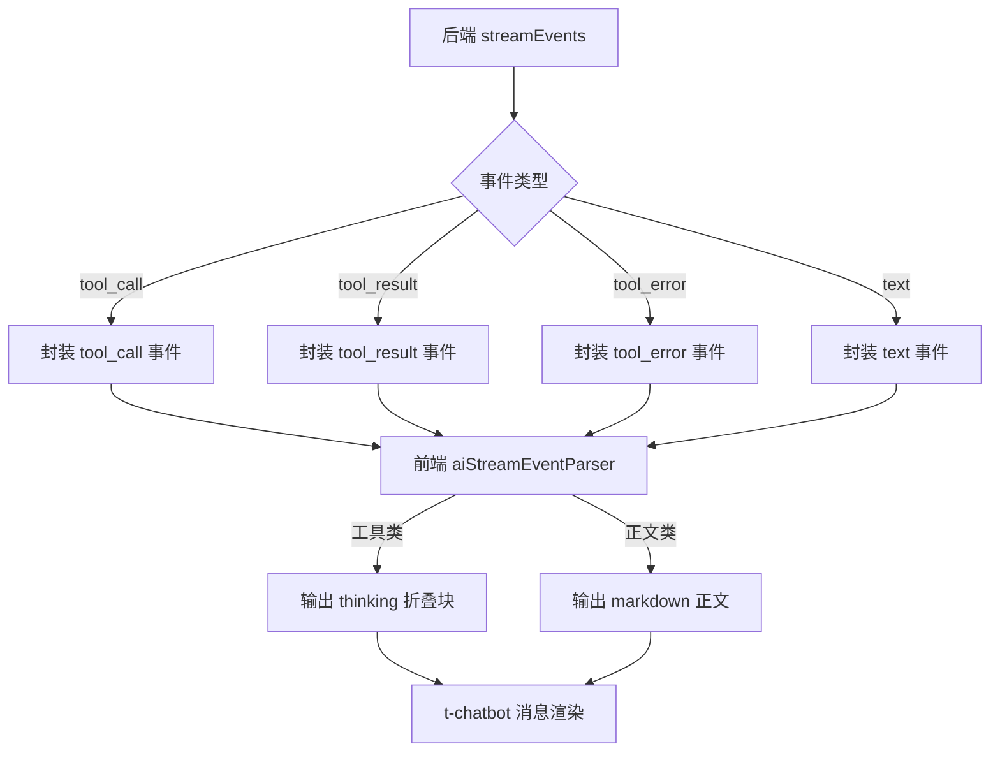
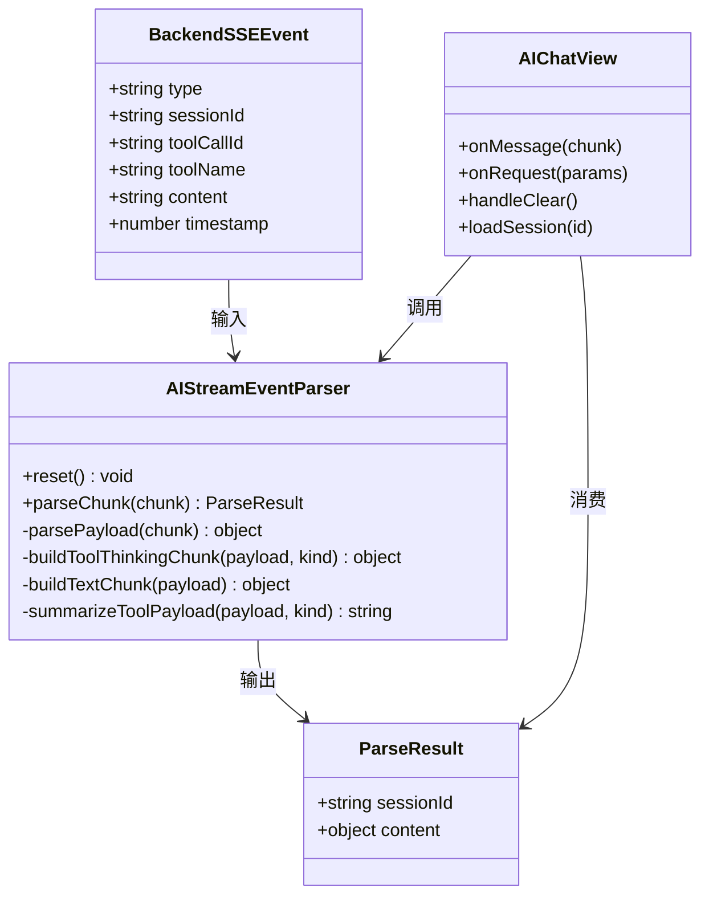

# AI聊天工具事件解析与展示设计

## 1. 背景与目标
当前问题：
- 工具调用记录与答案混在一起，且直接暴露大段 JSON/结构体。
- 缺少稳定的“折叠工具记录 + 独立答案内容”展示。

本设计目标：
1. 前后端流式协议字段稳定。
2. 前端使用独立 `parser.js` 解析并拆分事件。
3. 工具调用记录使用 `thinking` 内容（天然可折叠），答案使用 `markdown` 内容。
4. 默认不暴露原始 JSON，仅展示摘要；保留可控的 debug 原文透出能力。

## 2. 前后端交互字段

### 2.1 后端 SSE 事件（data JSON）
统一字段：
- `type`: `meta | text | think | tool_call | tool_result | tool_error`
- `sessionId`: string，可选
- `timestamp`: number，可选（毫秒）

工具事件字段：
- `toolCallId`: string，建议必传（同一调用链路唯一）
- `toolName`: string，建议必传
- `summary`: string，后端预处理后的可读摘要（前端优先使用）
- `content`: string，后端规范化后的主要内容（已做基础解包）
- `rawContent`: string，可选，原始内容截断文本（用于 debug）

### 2.2 前端 parser 输出字段（给 t-chatbot 的 content）
- 工具调用：
  - `type: "thinking"`
  - `strategy: "append"`
  - `data.title`: `🔧 工具调用 · <toolName>`
  - `data.text`: 摘要文本（参数摘要）
- 工具返回：
  - `type: "thinking"`
  - `strategy: "append"`
  - `data.title`: `✅ 工具返回 · <toolName>`
  - `data.text`: 摘要文本（结果摘要）
- 工具异常：
  - `type: "thinking"`
  - `strategy: "append"`
  - `data.title`: `❌ 工具异常 · <toolName>`
  - `data.text`: 错误摘要
- 模型正文：
  - `type: "markdown"`
  - `data`: 正文分片文本

## 3. 解析与拆分规则
1. 先解析 SSE `chunk.data` 为 payload。
2. `meta` 只更新 `sessionId`，不产出可视内容。
3. `tool_call/tool_result/tool_error` 统一走工具摘要提取器：
   - 优先使用后端传入 `summary`。
   - 无 `summary` 时前端再做兜底结构化提取（城市、日期、天气状态等）。
   - 默认隐藏原始 JSON；`debug` 模式显示 `rawContent`。
4. `text` 仅进入答案消息，避免混入工具明细。

## 4. Mermaid 流程图

## 5. Mermaid 结构图

## 6. 兼容与降级策略
- 若 `toolName` 缺失，显示 `unknown_tool`。
- 若结构化提取失败，展示 `已执行工具，结果已返回`。
- 若 `content` 过长，截断后附 `...`。
- 若后端未提供 `toolCallId`，前端仅按事件顺序展示，不做强绑定合并。

## 7. 安全与可观测性
- 默认隐藏原始结构体，减少敏感字段外露风险。
- 仅在 debug 模式（如 `?debug_tool_raw=1`）附带脱敏原文片段。
- parser 为纯函数 + 小状态对象，便于单测。
