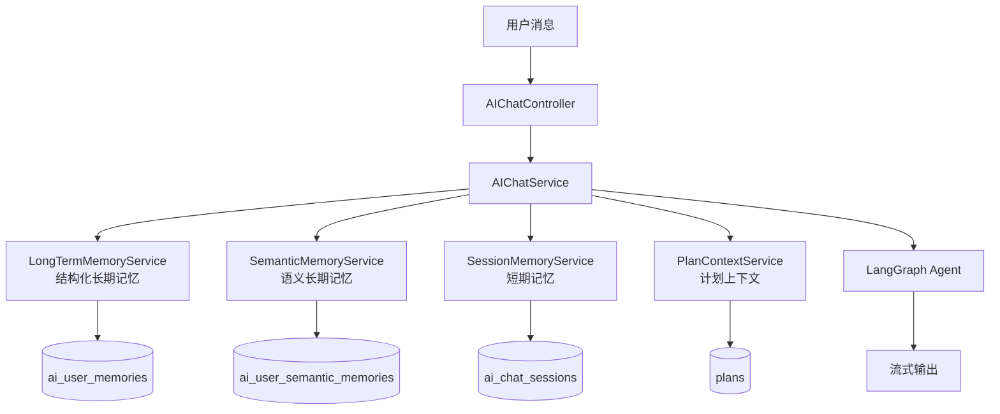

# AI 语义记忆层设计与实现说明

> 更新时间：2026-03-08  
> 适用范围：当前仓库中的 AI 聊天长期记忆增强层  
> 相关代码：
> - `backend/src/services/ai/semanticMemoryService.js`
> - `backend/src/services/aiChatService.js`
> - `backend/src/controllers/aiChatController.js`
> - `backend/src/routes/aiChatRoutes.js`
> - `frontend/src/views/MemoryCenterView.vue`
> - `supabase-setup.sql`

---

## 1. 这份文档是写给谁的

这份文档主要写给三类人：

1. 维护后端 AI 聊天链路的开发者
2. 需要理解“语义记忆为什么这样设计”的产品或技术负责人
3. 后续要继续优化 RAG、画像、推荐系统的人

它的目标不是只告诉你“代码里有哪些方法”，而是让你理解：

1. 语义记忆层到底解决了什么问题
2. 它和原来的结构化长期记忆是什么关系
3. 一条语义记忆是怎么被抽取、向量化、存储、召回和展示的
4. 如果它失败了，系统会退化成什么样

---

## 2. 先说结论

当前项目的长期记忆已经不是单一的一层。

它现在分成两部分：

1. 结构化长期记忆
   - 存在 `ai_user_memories`
   - 用固定 `memory_key` 存预算、节奏、住宿、饮食等强字段偏好
   - 适合“前端可编辑、可控、覆盖更新”的偏好项

2. 语义长期记忆
   - 存在 `ai_user_semantic_memories`
   - 用 `embedding + pgvector` 存不适合强字段建模的用户画像信息
   - 适合经验、约束、主题倾向、兴趣偏好这类弱结构化内容

语义记忆层不是为了替代结构化长期记忆，而是为了补足它表达力不够的部分。

可以把它理解成：

```text
结构化长期记忆 = 用户明确、稳定、可分类的偏好
语义长期记忆 = 用户在多轮对话里逐渐暴露出来的“画像信号”
```

---

## 3. 为什么原来的长期记忆不够

原来的长期记忆只有白名单键值模型。

它能很好地表达这类内容：

1. `budget_preference`
2. `travel_pace`
3. `transport_preference`
4. `accommodation_preference`
5. `food_preference`
6. `destination_preference`
7. `taboo`

但下面这些内容就不太好放：

1. “用户喜欢有生活气息的老城区，不喜欢纯商业景点”
2. “用户对排队特别敏感，愿意多花钱换更顺的行程”
3. “用户喜欢把博物馆和小馆子串在一起，而不是连续打卡大景点”
4. “用户会优先考虑体验密度，而不是单个景点知名度”

这些内容的问题在于：

1. 不是固定字段
2. 很难人工做表单
3. 很适合做相似语义召回
4. 对模型回答影响很大，但原来的系统只能把它们丢掉或者硬塞进某个字段

所以新增语义记忆层，专门处理这一类“有价值、但不适合强结构化”的长期信号。

---

## 4. 它在整体架构里的位置

语义记忆层挂在原有 AI 聊天链路中间，不改变原来的短期记忆、结构化长期记忆、计划上下文三层模型，只是新增一层补充画像。



你可以把它理解成：

1. `LongTermMemoryService` 负责“明确偏好”
2. `SemanticMemoryService` 负责“隐性画像”
3. 两者都会在聊天前参与上下文构建
4. 两者都会在聊天后尝试沉淀新的长期信息

---

## 5. 语义记忆层到底做了什么

`SemanticMemoryService` 主要做五件事：

1. 读取配置
2. 抽取语义记忆候选
3. 调 embedding 接口生成向量
4. 把向量和原文一起写入 Supabase
5. 在聊天前根据当前问题召回相关记忆

对应的方法大致如下：

### 5.1 `semanticMemoryConfig`

负责读取语义记忆层的核心配置：

1. 是否启用
2. 每次召回多少条
3. 相似度阈值
4. 每轮最多沉淀多少条语义记忆
5. embedding 使用哪个模型和 endpoint

### 5.2 `extractSemanticMemoryCandidates`

在一轮对话结束后，调用模型从“用户消息 + 助手回复”里抽取可长期复用的语义画像。

它要求模型只输出 JSON，并且只允许以下类型：

1. `preference`
2. `constraint`
3. `experience`
4. `interest`

也就是说，这一层不会把任何自由文本都存进去，而是先做一次“是否值得记住”的过滤。

### 5.3 `createEmbedding`

把一段语义记忆文本发给 ModelScope 的 OpenAI-compatible embeddings 接口，得到一个浮点向量。

当前实现默认是：

1. `baseURL = https://api-inference.modelscope.cn/v1`
2. `model = Qwen/Qwen3-Embedding-8B`
3. `encoding_format = float`
4. `dimensions = 4000`

如果你没有单独配置 `AI_EMBEDDING_API_KEY`，它会优先复用当前生效的 ModelScope 文本 provider token。

### 5.4 `upsertSemanticMemories`

把语义记忆写入 `ai_user_semantic_memories`。

写入前会生成一个 `memory_fingerprint`，本质是标准化文本后的 SHA-256 指纹。

这么做是为了：

1. 避免同一条记忆被反复写入
2. 保证同一用户的同义原文至少能做精确文本级去重
3. 支持后续做更复杂的语义合并

### 5.5 `searchRelevantMemories`

在聊天开始前，对“当前用户消息”生成 query embedding，然后调用 Supabase RPC：

```sql
match_ai_user_semantic_memories(query_embedding, query_user_id, match_count, min_similarity)
```

召回当前用户最相关的语义记忆，再把它们格式化成一段文本注入 system prompt。

注意，这里只用当前用户消息做查询，不混入计划上下文，也不混入整段短期历史。原因很简单：

1. 这样更稳定
2. 可以减少查询语义漂移
3. 语义记忆本质上是“用户画像召回”，不是“会话历史重放”

---

## 6. 一条语义记忆是怎么来的

下面用一条具体的例子说明。

假设用户说：

> 我不喜欢赶行程，宁愿少去几个景点，也想留时间逛老街和吃本地小馆。

AI 回复后，系统会在对话结束时做一次抽取，模型可能返回：

```json
{
  "memories": [
    {
      "memory_text": "用户偏好慢节奏旅行，更重视老街漫步和本地小馆体验",
      "memory_type": "preference",
      "tags": ["慢游", "老街", "本地美食"],
      "confidence": 0.91,
      "salience": 0.88
    }
  ]
}
```

随后系统会执行：

1. 规范化文本
2. 生成 `memory_fingerprint`
3. 调用 embedding 接口得到 4000 维向量
4. 把原文、类型、标签、权重、向量一起写入 `ai_user_semantic_memories`

以后如果用户又问：

> 帮我设计一个不要太赶、能逛街吃东西的两天行程

系统在聊天前就会把这条记忆召回出来，告诉模型：

```text
以下是与当前问题相关的用户语义画像记忆（跨会话检索）：
- (preference) 用户偏好慢节奏旅行，更重视老街漫步和本地小馆体验 [标签: 慢游 / 老街 / 本地美食]
```

这样模型回答时就更容易自然地匹配用户风格。

---

## 7. 聊天时的完整数据流

### 7.1 读路径：聊天前召回

每次 `POST /api/ai-chat` 时，和语义记忆有关的流程是：

1. 读取结构化长期记忆
2. 读取当前用户消息
3. 生成 query embedding
4. 调用 `match_ai_user_semantic_memories(...)`
5. 拿到 Top-K 语义记忆
6. 格式化成 `semantic_memory_block`
7. 拼到 system prompt 中

对应的 system prompt 组装顺序是：

```text
base_system_prompt
+ tool_rules_if_enabled
+ structured_long_term_memory_block
+ semantic_memory_block
+ plan_context_block
```

### 7.2 写路径：聊天后沉淀

当模型完成回答后，系统会再做两类长期记忆抽取：

1. 结构化长期记忆抽取
2. 语义长期记忆抽取

其中语义长期记忆这条线是：

1. 抽取候选 JSON
2. 过滤无效候选
3. 生成 embedding
4. upsert 到 `ai_user_semantic_memories`

---

## 8. 数据库里存了什么

语义记忆表是：

```text
public.ai_user_semantic_memories
```

关键字段解释如下：

### 8.1 `memory_text`

语义记忆的原文表达。

这是最终会被召回、展示、格式化成 prompt 的核心文本。

### 8.2 `memory_type`

语义记忆的类型。

当前只允许：

1. `preference`
2. `constraint`
3. `experience`
4. `interest`

这四类分别对应：

1. 偏好
2. 约束
3. 经验
4. 兴趣

### 8.3 `tags`

标签数组，用于画像聚合和前端展示。

例如：

```json
["慢游", "老街", "本地美食"]
```

### 8.4 `confidence`

抽取模型对“这条记忆是否靠谱”的置信度。

### 8.5 `salience`

这条记忆的重要程度。

它不完全等于置信度。可以理解为：

1. `confidence` 更偏“抽取对不对”
2. `salience` 更偏“这条内容值不值得在后续对话中优先考虑”

### 8.6 `memory_fingerprint`

标准化文本后的哈希指纹。

用来做：

1. 文本级去重
2. upsert 定位

### 8.7 `recall_count` 和 `last_recalled_at`

这两个字段用来记录：

1. 这条语义记忆被召回过多少次
2. 最近一次什么时候被召回

它们主要服务两个场景：

1. 前端画像页展示“最近被召回”
2. 后续做召回质量分析

### 8.8 `embedding`

真正用于向量检索的是 4000 维向量。

这里数据库列类型不是 `vector(4000)`，而是：

```sql
halfvec(4000)
```

原因是：

1. `Qwen/Qwen3-Embedding-8B` 原始输出是 4096 维
2. `pgvector` 的 `ivfflat` 对普通 `vector` 索引上限是 2000 维
3. `pgvector` 的 `ivfflat` 对 `halfvec` 索引上限是 4000 维

所以当前实现会在请求 embeddings 接口时显式传 `dimensions = 4000`，再把结果写入 `halfvec(4000)`。  
这样才能保留近似向量索引能力。

---

## 9. Supabase 这边做了什么

`supabase-setup.sql` 里新增了三类东西：

### 9.1 `vector` 扩展

用来让 Postgres 支持向量列和向量检索。

### 9.2 `ai_user_semantic_memories` 表

负责存储语义记忆原文和向量。

### 9.3 `match_ai_user_semantic_memories(...)` RPC

负责在数据库里完成按用户过滤 + 向量相似度排序。

它做的事情可以粗略理解成：

```text
在当前用户自己的语义记忆里，
找出和 query embedding 最相似的前 N 条，
并过滤掉相似度太低的结果。
```

其中查询向量在 SQL 里会被转换成 `halfvec(4000)` 再参与距离计算，以匹配索引类型。

---

## 10. 配置怎么理解

当前语义记忆层用到的配置有：

```env
AI_CHAT_SEMANTIC_MEMORY_ENABLED=true
AI_CHAT_SEMANTIC_MEMORY_TOP_K=4
AI_CHAT_SEMANTIC_MEMORY_MIN_SIMILARITY=0.65
AI_CHAT_SEMANTIC_MEMORY_MAX_ITEMS_PER_TURN=3
AI_EMBEDDING_BASE_URL=https://api-inference.modelscope.cn/v1
AI_EMBEDDING_MODEL=Qwen/Qwen3-Embedding-8B
AI_EMBEDDING_DIM=4000
AI_EMBEDDING_API_KEY=
```

下面解释每个配置的含义。

### 10.1 `AI_CHAT_SEMANTIC_MEMORY_ENABLED`

总开关。

关闭后：

1. 不会做语义召回
2. 不会写入语义记忆
3. 画像页会退化为空画像

### 10.2 `AI_CHAT_SEMANTIC_MEMORY_TOP_K`

聊天前最多召回多少条语义记忆。

值越大：

1. 召回信息更多
2. prompt 更长
3. 也更容易引入噪声

### 10.3 `AI_CHAT_SEMANTIC_MEMORY_MIN_SIMILARITY`

向量召回的最低相似度阈值。

值越高，召回结果越保守。

### 10.4 `AI_CHAT_SEMANTIC_MEMORY_MAX_ITEMS_PER_TURN`

每轮对话最多沉淀多少条语义记忆。

这是为了避免一轮对话被抽取出太多“边缘信息”。

### 10.5 `AI_EMBEDDING_API_KEY`

如果填了，就直接用它调 embeddings 接口。

如果不填，系统会尝试复用当前生效的 ModelScope 文本 provider token。

---

## 11. 前端能看到什么

长期记忆中心现在除了结构化偏好编辑区，还新增了一个只读“AI 语义画像”区域。

它会展示：

1. 画像摘要
2. 高频标签
3. 高 salience 语义记忆
4. 最近被召回的语义记忆
5. 统计信息

对应接口是：

```text
GET /api/ai-chat/memory/profile
```

返回结构大致是：

```json
{
  "structured_memories": [],
  "semantic_profile": {
    "summary": "结构化偏好集中在 ...。语义画像显示用户长期关注 ...",
    "tags": ["慢游", "文化", "老街"],
    "highlights": [
      {
        "id": "xxx",
        "memory_text": "用户偏好老城漫步和博物馆",
        "memory_type": "interest",
        "tags": ["文化", "老城"],
        "salience": 0.95,
        "updated_at": "2026-03-08T10:00:00.000Z"
      }
    ],
    "recent_memories": [
      {
        "id": "xxx",
        "memory_text": "用户对排队敏感",
        "last_recalled_at": "2026-03-08T10:00:00.000Z",
        "recall_count": 4
      }
    ],
    "stats": {
      "total_memories": 12,
      "active_tags": 8,
      "recalled_last_30d": 9
    }
  }
}
```

---

## 12. 失败时系统会怎么样

这是这套设计里很重要的一点。

语义记忆层是“增强能力”，不是“主链路硬依赖”。

所以它的降级策略是：

### 12.1 找不到 embedding token

结果：

1. 不做语义召回
2. 不做语义写入
3. 结构化长期记忆、短期记忆、计划上下文全部照常工作

### 12.2 Supabase 表没建好

结果：

1. 语义层直接返回空结果
2. 聊天不会失败

### 12.3 RPC 不存在

结果：

1. 语义召回返回空
2. 聊天继续进行

### 12.4 embedding 接口失败

结果：

1. 当前这轮不会写入新语义记忆
2. 不会影响本轮回答

这意味着语义记忆层在工程上是“尽量有、没有也不炸”。

---

## 13. 和结构化长期记忆的分工

最容易混淆的地方就是这个。

简单记：

### 13.1 应该进结构化长期记忆的内容

1. 预算范围
2. 交通偏好
3. 住宿标准
4. 饮食偏好
5. 明确禁忌

特点是：

1. 稳定
2. 类别明确
3. 前端适合直接编辑

### 13.2 应该进语义长期记忆的内容

1. 行程风格偏好
2. 体验选择倾向
3. 排队、密度、氛围等隐性偏好
4. 多轮对话慢慢形成的用户画像

特点是：

1. 难以做成固定字段
2. 更适合“按问题检索相关记忆”
3. 更适合在聊天时按语义召回，而不是全量硬塞

---

## 14. 当前实现的限制

虽然已经能工作，但它还不是终态。

当前限制主要有：

1. 去重目前主要依赖 `memory_fingerprint`，还是文本级去重，不是语义合并
2. 没有人工管理语义记忆的能力，只有只读画像
3. 画像摘要目前是后端即时拼装，不是单独缓存的画像快照
4. 召回排序主要依赖相似度和 `salience`，还没有更复杂的重排策略
5. 还没有做“错误提取回滚”或人工纠错

---

## 15. 维护者最常见的问题

### 15.1 为什么不直接把所有历史消息做向量化

因为我们要的是“长期可复用的用户画像”，不是“对话日志搜索”。

如果把所有消息都直接入库：

1. 噪声会很多
2. 临时问题会污染长期画像
3. 召回结果会非常不稳定

所以当前设计是先抽取“值得记住的语义信息”，再向量化。

### 15.2 为什么不用计划上下文去做查询向量

因为计划上下文是业务态上下文，不是用户画像本身。

把计划上下文混进去，容易把“当前计划的信息”误召回成“长期偏好”。

### 15.3 为什么没有开放语义记忆编辑

第一版的目标是先把链路打通：

1. 能抽
2. 能存
3. 能召回
4. 能看见

人工编辑、删除、置顶、屏蔽这些功能后续可以再做。

---

## 16. 如果你要排查问题，从哪里看

### 16.1 怀疑没有召回

先看：

1. `memory_metrics` 里的 `semantic_memory_count`
2. `memory_metrics` 里的 `semantic_memory_retrieved`
3. 当前用户是否真的有 `ai_user_semantic_memories` 数据
4. `AI_CHAT_SEMANTIC_MEMORY_MIN_SIMILARITY` 是否太高

### 16.2 怀疑写入失败

先看：

1. 是否配置了 ModelScope token
2. `Qwen/Qwen3-Embedding-8B` 是否可调用
3. `ai_user_semantic_memories` 表和 RPC 是否已执行
4. 后端日志里有没有 `Upsert semantic memory failed`

### 16.3 怀疑前端画像为空

先看：

1. `/api/ai-chat/memory/profile` 是否有返回
2. 返回里的 `semantic_profile.stats.total_memories` 是否为 0
3. 后端是否因为 embedding 不可用而自动降级

---

## 17. 总结

语义记忆层的本质不是“再多存一点聊天记录”，而是：

1. 从聊天里抽取长期可复用的画像信号
2. 用 embedding 把这些信号转成可检索的向量
3. 在真正相关的问题出现时，把相关画像记忆召回给模型

它补的是结构化长期记忆表达力不够的那一块。

所以可以用一句话概括：

```text
结构化长期记忆负责“明确偏好”，语义记忆层负责“隐性画像”。
```

如果后续继续演进，这一层最值得做的方向会是：

1. 语义记忆合并与压缩
2. 召回排序优化
3. 人工纠错和管理
4. 画像快照缓存
5. 与推荐系统、规划系统联动
