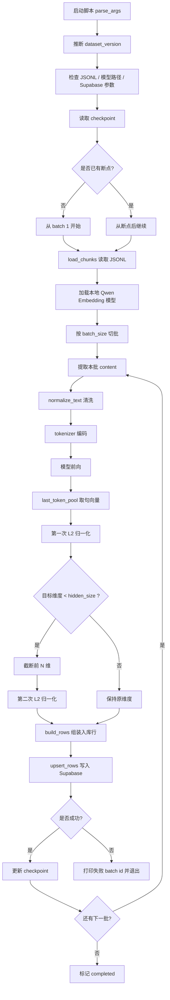

# RAG Embedding 入库流程说明

> 更新时间：2026-03-15  
> 适用文件：`backend/scripts/ingest_local_qwen.py`

本文只说明“本地 Qwen Embedding 模型 -> Supabase”的入库流程。  
如果你想看整体 RAG 运行时，请回到 `docs/RAG知识库技术文档.md`。

## 1. 这份文档讲什么，不讲什么

这份文档聚焦 3 件事：

1. `ingest_local_qwen.py` 如何读取 JSONL
2. 如何把每条 `content` 变成 embedding
3. 如何把向量和元数据写入 `travel_knowledge`

它不覆盖：

- 爬虫抓取和 chunk 生产
- 运行时检索链路
- AI Chat 如何使用检索结果

## 2. 整体流程



## 3. 脚本的关键输入

脚本支持命令行参数，也会读取 `.env`。

最重要的输入有：

- `--file` / `RAG_KNOWLEDGE_FILE`
- `--model-path` / `QWEN_EMBEDDING_MODEL_PATH`
- `--supabase-url` / `SUPABASE_URL`
- `--supabase-key` / `SUPABASE_SERVICE_ROLE_KEY`
- `--dim` / `QWEN_EMBEDDING_DIM`
- `--kb` / `RAG_KB_SLUG`
- `--dataset-version` / `RAG_DATASET_VERSION`
- `--checkpoint-file`

默认行为：

- `dataset_version` 会优先从文件名 `knowledge_<version>_filtered.jsonl` 推断
- `kb_slug` 默认是 `travel-cn-public`
- `dim` 默认是 `1024`

## 4. 为什么 embedding 只取 `content`

脚本在真正做向量化时，只提取每条 chunk 的 `content`：

```python
texts = [normalize_text(item.get("content")) for item in batch]
```

这样做的原因是：

- `content` 是主要语义正文
- `city`、`title`、`poiName` 更适合做过滤和展示
- 元信息已经会作为结构化字段入库，不必强行混进向量

当前设计可以理解成：

- 语义检索靠 `content + embedding`
- 结构过滤靠 `city/type/poi_name/...`

## 5. `normalize_text()` 在解决什么问题

本地模型链路里，`normalize_text()` 的职责不是“润色文本”，而是保证 tokenizer 安全可用。

它主要处理：

- `None` 转空字符串
- 非字符串类型转字符串
- 删除孤立 Unicode 代理字符
- 去掉首尾空白

这么做的原因是：

- Python 字符串能容忍脏字符
- `transformers` tokenizer 未必能稳定处理这些脏字符
- 不先清洗，常见故障会直接出现在 tokenizer 阶段

## 6. 本地模型如何生成句向量

### 6.1 tokenizer

脚本使用：

```python
tokenizer(
    texts,
    padding=True,
    truncation=True,
    max_length=8192,
    return_tensors="pt",
)
```

这里的 `max_length=8192` 只是“送进模型前的安全上限”，不是 chunk 切分策略本身。

### 6.2 前向输出

模型输出的关键张量是：

```python
outputs.last_hidden_state
```

它的形状可以理解为：

```text
[batch_size, seq_len, hidden_size]
```

对于默认本地 `Qwen3-Embedding-4B`，`hidden_size` 通常是 `2560`。

### 6.3 `last_token_pool`

脚本没有做平均池化，而是使用 Qwen 官方推荐的 `last_token_pool()`：

- 左侧 padding 时，直接取最后一个位置
- 否则根据 `attention_mask` 找每条文本最后一个有效 token

结果会从 token 级表示压缩成句子级表示：

```text
[batch_size, seq_len, 2560]
-> [batch_size, 2560]
```

## 7. 为什么要做两次归一化

### 7.1 第一次归一化

先对完整句向量做一次 L2 normalize：

```python
embeddings = F.normalize(embeddings, p=2, dim=1)
```

作用：

- 让余弦相似度更稳定
- 避免向量长度差异影响检索

### 7.2 截断维度

如果目标维度 `dim` 小于模型原始输出维度，就会执行：

```python
embeddings = embeddings[:, : self.dim]
```

这通常对应：

- 原始向量 `2560`
- 目标向量 `1024`

这么做是为了和 `rag-setup.sql` 中的 `VECTOR(1024)` 保持一致，也为了降低存储和检索成本。

### 7.3 第二次归一化

截断后会再次做一次 L2 normalize：

```python
embeddings = F.normalize(embeddings, p=2, dim=1)
```

原因很直接：

- 截断会改变向量长度
- 如果不再归一化，最终写入库的向量就不再是单位向量

## 8. 写库时保留了哪些信息

`build_rows()` 会把每条 chunk 组装成完整数据库行，除了 `embedding` 外，还会带上：

- `kb_slug`
- `dataset_version`
- `external_id`
- `city`
- `type`
- `title`
- `section_title`
- `sub_section_title`
- `poi_name`
- `content`
- `tags`
- `source`
- `source_url`
- `license`
- `lang`
- `content_hash`
- `metadata`

这里的设计理念是：

- JSONL 是“源数据”
- 数据库是“带向量的派生产物”
- 但派生产物仍尽量保留足够元数据，方便后续回溯、迁移和重建

## 9. 如何写入 Supabase

脚本通过 PostgREST 直接写入：

- 目标表：`travel_knowledge`
- 冲突键：`kb_slug,content_hash`
- 策略：`resolution=ignore-duplicates`

这意味着：

- 重复跑不会重复插入
- 已存在的同内容行默认会被忽略

## 10. 为什么这个脚本支持断点续跑

本地 embedding 最重的成本通常不是写库，而是：

- 模型加载
- GPU/CPU 推理
- 大文件长时间批处理

所以 `ingest_local_qwen.py` 增加了 checkpoint 机制：

- 每批成功后记录 `last_success_batch`
- 下次启动时继续跑剩余批次
- 全部完成后标记 `completed`

这对大文件、本地显卡不稳定、或者中途手动中断都很有用。

## 11. 与 `ingest.js` 的区别

`ingest_local_qwen.py` 和 `ingest.js` 的主要区别不是“写库结构”，而是“embedding 怎么来”。

### `ingest_local_qwen.py`

- 本地 `transformers` 模型
- 支持 checkpoint
- 适合离线批处理

### `ingest.js`

- 远程 OpenAI-compatible embeddings API
- 实现更轻
- 不需要本地模型环境

两者最终都写向同一张 `travel_knowledge` 表。

## 12. 一句话总结

这条本地入库链路本质上在做：

1. 读取知识库 JSONL
2. 取每条 `content`
3. 清洗后送进本地 Qwen Embedding 模型
4. 用 `last_token_pool` 取句向量
5. 归一化并按需截断到 1024 维
6. 连同元数据一起写入 Supabase
7. 用 checkpoint 保证长任务可续跑
