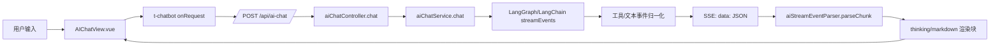
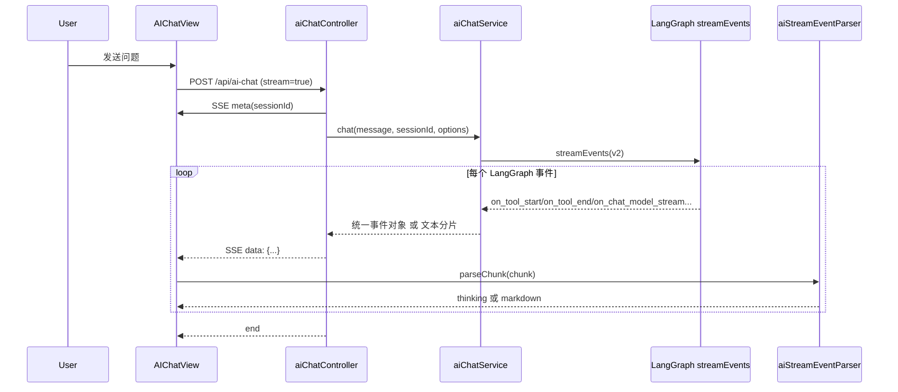

# AI 对话 SSE 与工具事件解析设计（前后端联调版）

## 1. 文档目标
本文件用于统一解释当前 AI 对话链路中：
1. 后端如何将模型流式输出与工具事件转换为 SSE。
2. 前端如何把 SSE 分片解析为聊天组件可渲染的内容。
3. 工具调用记录如何与最终回答分离展示。
4. Debug 模式与异常降级策略。

适用对象：答辩讲解、联调排障、后续重构。

> 说明：若需要查看 Chat 与 Plan 的统一字段命名规范，请参考 `./AI统一流式事件协议.md`。

---

## 2. 总体架构


---

## 3. 端到端时序


---

## 4. 后端 SSE 协议
控制器位置：`backend/src/controllers/aiChatController.js`

### 4.1 通用字段
- `type`: `meta | text | think | tool_call | tool_result | tool_error`
- `sessionId`: 会话 ID（`meta` 必带，其他事件可带）
- `content`: 文本内容或归一化后的字符串内容

### 4.2 工具事件字段
- `toolName`: 工具名
- `toolCallId`: 工具调用唯一标识（尽力解析）
- `summary`: 后端摘要（优先给前端展示）
- `content`: 后端解包后的主要内容（便于常规展示）
- `rawContent`: 原始内容（便于 debug，默认前端不展示）

### 4.3 示例
#### meta
```json
{ "type": "meta", "sessionId": "7dbc5c9a-..." }
```

#### tool_call
```json
{
  "type": "tool_call",
  "toolName": "maps_weather",
  "toolCallId": "run-abc",
  "summary": "city=杭州",
  "content": "{\"city\":\"杭州\"}",
  "rawContent": "{\"input\":\"{\\\"city\\\":\\\"杭州\\\"}\"}"
}
```

#### text
```json
{ "type": "text", "content": "根据查询结果，杭州今天..." }
```

---

## 5. 后端服务层实现要点
服务位置：`backend/src/services/aiChatService.js`

### 5.1 事件映射
LangGraph 事件映射关系：
- `on_tool_start` -> `tool_call`
- `on_tool_end` -> `tool_result`
- `on_tool_error` -> `tool_error`
- `on_chat_model_stream` -> `text`

### 5.2 工具 payload 解包
`unwrapToolPayload` 会递归解包常见结构：
- `kwargs.content`
- `additional_kwargs.content`
- `data.content`
- `output/result/content/input`

目的：减少前端拿到“套娃 JSON”。

### 5.3 摘要生成
`summarizeToolPayload(toolName, phase, value)` 负责生成 `summary`：
- tool_call 阶段优先提取参数（例如 `city=杭州`）
- 天气工具尝试合成“城市 + 日期 + 温度”摘要
- 兜底为 key-value 摘要或首行文本

### 5.4 异常映射
对模型限流/繁忙等错误统一映射为中文可读提示：
- `Too many requests / throttled / capacity limits / ServiceUnavailable / <503>`
- 归一为 `MODELSCOPE_REQUEST_LIMIT` 类语义

---

## 6. 前端解析器设计
解析器位置：`frontend/src/utils/aiStreamEventParser.js`

### 6.1 输入与输出
输入：SSE `chunk`（包含 `data`）  
输出：`{ sessionId, content }`

其中 `content` 为 t-chatbot 消息分片：
- 工具事件 -> `thinking`（折叠块）
- 模型正文 -> `markdown`

### 6.2 解析策略
1. 先 `parsePayload`。
2. `meta`：只回传 `sessionId`，不渲染。
3. `tool_call/result/error`：
   - 优先 `payload.summary`
   - 无 `summary` 则本地 `pickSummary(...)` 兜底
   - 输出 `thinking`，标题含工具名和阶段
4. `text`：输出 `markdown` 分片。

### 6.3 原文展示策略
- 默认：仅显示摘要，不透出原始结构体。
- `?debug_tool_raw=1`：追加 `rawContent` 片段到折叠块中，便于排障。

---

## 7. AIChatView 中的接入点
视图位置：`frontend/src/views/AIChatView.vue`

### 7.1 请求阶段
`chatServiceConfig.onRequest` 负责：
- 通过 `credentials: include` 自动携带 HttpOnly Cookie（不再注入 `Authorization`）
- 传递 `enable_tools`
- 可选 `debug_stream`

### 7.2 流式阶段
`chatServiceConfig.onMessage`：
1. 调用 `streamEventParser.parseChunk(chunk)`
2. 读取 `sessionId`
3. 返回 `content` 给 t-chatbot 渲染

### 7.3 会话管理阶段
- 新对话：`handleClear` 会重置 parser 状态
- 加载历史会话：`loadSession` 会重置 parser 并替换消息列表

---

## 8. Debug 与联调参数
### 8.1 `debug_stream=1`
- 入口：`/api/ai-chat?debug_stream=1`
- 行为：后端不走模型，发送固定测试文本流（逐字），用于验证 SSE 渲染链路。

### 8.2 `debug_tool_raw=1`
- 入口：前端页面 query 参数
- 行为：前端解析器在工具折叠块中展示 `rawContent` 片段。

---

## 9. 降级与兼容策略
1. `toolName` 缺失：展示 `unknown_tool`。
2. `summary` 缺失：前端本地兜底摘要。
3. payload 不是合法 JSON：按纯文本处理并截断。
4. `meta` 缺失：仍可渲染文本，但会话关联能力下降。

---

## 10. 与虚拟列表文档的关系
本文件关注“消息流解析与展示语义”。  
历史会话性能优化（虚拟渲染）详见：
- `./历史会话虚拟渲染实现详解.md`

鉴权与会话安全改造详见：
- `../auth/认证与AI聊天安全改造说明.md`

---

## 11. 答辩讲解建议（3 分钟版）
1. 先讲“协议分层”：后端统一事件类型，前端只做渲染语义转换。
2. 再讲“工具记录与答案分离”：`thinking` 与 `markdown` 各司其职。
3. 再讲“可维护性”：后端 `summary` 优先，前端仅做兜底。
4. 最后讲“可运维”：`debug_stream` 验证链路，`debug_tool_raw` 验证工具原始返回。

---

## 12. LangChain / LangGraph 实际落地（代码对照）

本节回答两个问题：
1. 项目里哪些位置真正使用了 LangChain / LangGraph。
2. Agent 是如何构建、如何降级、如何执行工具与回传流式事件。

### 12.1 依赖与启动入口
- 依赖声明：`backend/package.json`
  - `@langchain/core`
  - `@langchain/langgraph`
  - `@langchain/openai`
  - `langchain`
- 启动注入：`backend/src/index.js`
  - 启动时执行 `applyLangChainTokenPatch()`（兼容 token 估算）。
  - 初始化 `LangChainManager`，并注入到 `PlanService`、`AIChatService`。

### 12.2 LangChain 主要使用位置

1. 模型与提供商管理（文本/图片/Embedding/Rerank）
  - 文件：`backend/src/services/langchain/LangChainManager.js`
  - 关键能力：
    - `invokeText(...)`：按 provider 优先级调用并在失败时切换。
    - `generateImage(...)`：图片模型调用与错误降级。
    - `runWithTrace(...)`：追踪 request 维度的调试上下文。

2. 具体文本模型实现
  - 文件：`backend/src/services/langchain/text/OpenAICompatibleAdapter.js`
  - 通过 `ChatOpenAI` 创建 LLM（`streaming: true`），作为 Agent 的底层模型。

3. MCP 工具转 LangChain Tool
  - 文件：`backend/src/services/mcpService.js`
  - `getLangChainTools()` 将 MCP `tools/list` 结果转换为 `DynamicStructuredTool`：
    - 输入 schema：JSON Schema -> Zod
    - 执行逻辑：`callTool(...)` + 超时控制

4. 会话历史与消息类型映射
  - 文件：`backend/src/services/langchain/SupabaseMessageHistory.js`
  - 将数据库消息与 `HumanMessage / AIMessage / ToolMessage` 互转，保留 `tool_calls/tool_call_id`。

5. LangChain/LangGraph 事件统一协议
  - 文件：`backend/src/services/ai/streamToolEvents.js`
  - 将 `on_tool_start/on_tool_end/on_tool_error` 归一为 `tool_call/tool_result/tool_error`。

### 12.3 LangGraph Agent 构建逻辑（核心）

文件：`backend/src/services/langchain/LangChainManager.js` 的 `createAgent(...)`

构建步骤：
1. 使用 `@langchain/langgraph/prebuilt` 的 `createReactAgent` 创建 ReAct Agent。
2. 对候选文本 provider 做筛选与排序：
  - 先按 `allowedProviders` 过滤
  - 再把 `provider`（首选）放到最前
3. 为每个 provider 分别创建一个 Agent Runnable：
  - `adapter.createLLM()` 得到该 provider 的 LLM
  - `llm.withConfig({ metadata: { provider, model } })`
  - `agent.withConfig({ metadata, runName })`
4. 将多个 Agent 通过 `primary.withFallbacks(fallbacks)` 组合。

结论：
- 这是“同构多 Provider Agent + Runnable 级 fallback”方案。
- 当前并未手写自定义 StateGraph 节点；采用的是 LangGraph prebuilt ReAct Agent。

### 12.4 Chat 链路中的 Agent 执行

文件：`backend/src/services/aiChatService.js`

主要流程：
1. 组装系统提示词（可选注入 RAG 上下文）。
2. 工具集构建：
  - 内置 `query_train_tickets`
  - 可选 `search_travel_knowledge`
  - MCP 动态工具 `mcpService.getLangChainTools()`
3. 调用 `langChainManager.createAgent(...)` 生成 Agent Runnable。
4. 通过 `agentRunnable.streamEvents(..., { version: 'v2' })` 流式执行。
5. 事件处理：
  - `on_chat_model_stream` -> 文本分片
  - `on_tool_*` -> `buildToolEventFromLangChainEvent(...)` 归一化工具事件
6. 有状态会话时：
  - 先加载 `SupabaseMessageHistory`
  - 结束后按增量写回消息

补充：
- 对 `search_travel_knowledge` 额外做了单轮次数限制（防止工具过度调用）。

### 12.5 Plan 链路中的 Agent 执行

文件：`backend/src/services/planService.js`

主要流程：
1. 拉取 MCP 工具列表：`mcpService.getLangChainTools()`。
2. 构建 Agent：`langChainManager.createAgent(...)`。
3. 配置回调桥接：`createToolStepCallbacks(...)`，将工具步骤实时推给前端。
4. 执行：`agentRunnable.invoke({ messages }, { recursionLimit, callbacks })`。
5. 读取 `finalState.messages`，提取最终文本与步骤摘要，最后归一化为结构化行程。

控制项（环境变量）：
- 总超时：`AI_PLAN_TIMEOUT_MS`
- 递归限制：`AI_CHAT_AGENT_RECURSION_LIMIT`
- 工具调用上限：`AI_PLAN_MAX_TOOL_CALLS`

### 12.6 与本文协议的关系

本文上半部分定义了“工具事件如何解析与展示”。
本节补充了“这些事件从哪里来”：
- 来源是 LangGraph `streamEvents` 与回调。
- 归一化由 `streamToolEvents` 承担。
- Chat 与 Plan 共享同一套工具事件语义。

