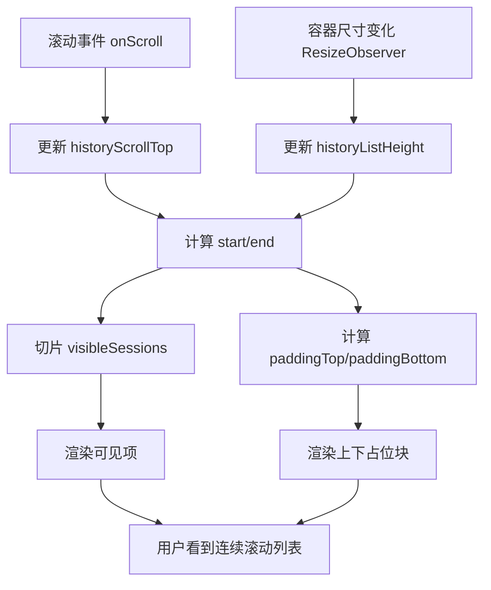

# 历史会话虚拟渲染实现详解

## 1. 目标与背景
历史会话数量增大后（数百到数千条），若直接 `v-for` 全量渲染，会出现：
- 首屏渲染慢（DOM 节点过多）
- 滚动卡顿（重排/重绘压力高）
- 侧边栏交互延迟（点击、hover、删除按钮响应变慢）

本实现目标：
1. 只渲染可视区域附近的数据项（虚拟列表）。
2. 保持原有交互能力（选中、删除、刷新、展开/收起）。
3. 不引入额外依赖库，使用 Vue 组合式 API 自实现。

## 2. 适用范围
- 页面：`AIChatView` 左侧历史对话列表
- 数据来源：`/api/ai-chat/sessions`
- 列表项高度：近似固定（实现中按固定高度计算）

## 3. 核心设计
### 3.1 固定高度虚拟化
实现采用“固定行高 + 上下占位块”的经典方案：
- 真实渲染区：只渲染 `visibleSessions`
- 顶部占位：`virtualPaddingTop`
- 底部占位：`virtualPaddingBottom`

这样浏览器滚动条的总高度看起来与全量列表一致，但实际 DOM 节点数量远小于总条数。

### 3.2 关键状态
- `historyListRef`: 列表滚动容器
- `historyScrollTop`: 当前滚动偏移
- `historyListHeight`: 容器可视高度
- `historyItemHeight = 84`: 每项估算高度（px）
- `historyOverscan = 6`: 可视区上下额外渲染条目数

### 3.3 关键计算
设：
- `N = displayedSessions.length`
- `H = historyListHeight`
- `h = historyItemHeight`
- `s = historyScrollTop`
- `o = historyOverscan`

计算逻辑：
1. 可视条目数（含 overscan）  
`visibleCount = ceil(H / h) + 2 * o`

2. 起始索引  
`start = max(0, floor(s / h) - o)`

3. 结束索引  
`end = min(N, start + visibleCount)`

4. 实际渲染数组  
`visibleSessions = displayedSessions.slice(start, end)`

5. 占位高度  
`paddingTop = start * h`  
`paddingBottom = (N - end) * h`

## 4. 数据流与渲染流程


## 5. 与现有业务逻辑的衔接
### 5.1 与“展开/收起会话”配合
- `displayedSessions` 先决定“最近 N 条”还是“全部”
- 虚拟列表在 `displayedSessions` 之上再做窗口切片

这意味着：
- 折叠状态下：虚拟化处理的数据更少
- 展开状态下：虚拟化保证全量也可流畅

### 5.2 与“刷新/登录态变化”配合
- 加载新会话后调用 `setupHistoryResizeObserver()`，确保高度计算准确
- `sessions.length` 变化时重新测量
- 展开状态切换时重置滚动到顶部，避免索引错位

### 5.3 与“会话点击加载历史”配合
虚拟化只影响“渲染数量”，不影响每项行为：
- 点击加载会话 `loadSession`
- 删除会话 `confirmDeleteSession`
- 当前会话高亮 `is-active`

## 6. 性能分析
### 6.1 复杂度对比
- 全量渲染：DOM 节点数 `O(N)`
- 虚拟渲染：DOM 节点数 `O(V + 2o)`（`V` 为可视区条目数）

通常 `V` 是常数级（例如 8~16），因此总体渲染成本接近常数。

### 6.2 典型收益
以 `N=2000` 为例：
- 全量：约 2000 条 DOM + 子节点
- 虚拟化：仅渲染约 20~40 条（取决于窗口高度和 overscan）

滚动帧稳定性和首次渲染耗时会显著改善。

## 7. 参数选择理由
### 7.1 `historyItemHeight = 84`
- 历史项包含标题、元信息、内边距，实测平均高度约 76~84px
- 略大于最小高度可减少“快速滚动时露白”风险

### 7.2 `historyOverscan = 6`
- 过小：快速滚动容易出现临时空白
- 过大：DOM 增多，性能收益下降
- 6 是当前 UI/滚动速度下较平衡的值

## 8. 边界与异常处理
1. 容器高度暂不可用：`visibleCount` 兜底为 20。
2. 列表为空：直接展示空态，不进入虚拟渲染流程。
3. 面板收起后重新打开：重置 `scrollTop` 并重新观测容器。
4. 数据突变（删除当前项）：依赖响应式重新计算 `start/end`，避免越界。

## 9. 可调优点
1. 改为“动态行高虚拟化”（当前为固定行高）。
2. 根据滚动速度动态调节 overscan。
3. 增加“滚动到当前会话”定位能力。
4. 会话列表改成分页拉取 + 虚拟化组合（超大数据量）。

## 10. 分页请求与滚动加载（当前实现）
### 10.1 后端接口分页
接口：`GET /api/ai-chat/sessions?page=<n>&page_size=<m>`

返回结构：
```json
{
  "sessions": [ ... ],
  "pagination": {
    "page": 1,
    "pageSize": 20,
    "hasMore": true
  }
}
```

实现要点：
1. 后端 service 使用 `range(offset, offset + limit)` 拉取 `limit + 1` 条。
2. 若返回条数 `> limit`，则 `hasMore = true`，并裁剪到 `limit` 返回。
3. 该策略避免额外 count 查询，成本低，适合滚动加载场景。

### 10.2 前端滚动触底加载
触发条件（历史列表滚动事件）：
- `distanceToBottom <= 36`
- 且 `showAllSessions = true`
- 且当前不在 loading
- 且 `hasMoreSessions = true`

触发行为：
1. 请求下一页 `page = sessionsPage + 1`。
2. 仅追加新会话（按 `conversation_id` 去重）。
3. 更新 `hasMoreSessions` 与 `sessionsPage`。

### 10.3 底部加载提示
在历史列表底部增加提示区：
- 加载中：`正在加载更多历史对话...`
- 可继续加载：`下拉到底加载更多`
- 全部加载完：不再展示加载提示

## 11. 新增卡片逐个弹出动画
新增会话批次（分页 append）会触发“逐条进入”：
1. 为每条新增记录写入 `delayMap[id] = index * 55ms`
2. 列表项带上 `is-appearing` 类和 `--appear-delay`
3. CSS `historyItemAppear` 动画执行（位移+透明度）
4. 定时清理延迟 map，避免重复滚动时重复触发

这样可实现“加载后卡片逐个弹出”的视觉反馈，且不会影响普通滚动性能。

## 12. 答辩讲解建议
可按以下顺序讲：
1. 问题：全量渲染导致性能退化。
2. 思路：只渲染“用户看得见”的窗口数据。
3. 方法：`start/end + top/bottom spacer`。
4. 成果：DOM 数量从 `O(N)` 降到近似常数级。
5. 扩展：通过“分页 + 触底加载 + 进入动画”兼顾性能与交互反馈。
6. 取舍：固定行高实现简单稳定；后续可升级动态行高。

## 13. 关键代码定位
- 视图与虚拟占位：`frontend/src/views/AIChatView.vue` 中 `history-list`、`history-virtual-spacer`
- 计算逻辑：`virtualStartIndex / virtualEndIndex / visibleSessions`
- 尺寸观测：`setupHistoryResizeObserver`
- 滚动驱动：`handleHistoryScroll`
- 分页接口：`backend/src/controllers/aiChatController.js`、`backend/src/services/aiChatService.js`
- 分页状态：`sessionsPage / sessionsPageSize / hasMoreSessions`
- 动画逻辑：`appendSessionAppearAnimations` 与 `.history-item.is-appearing`
