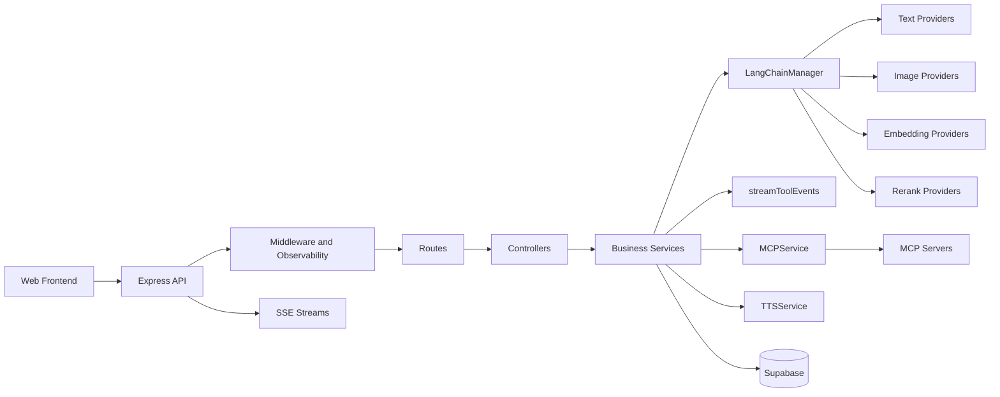
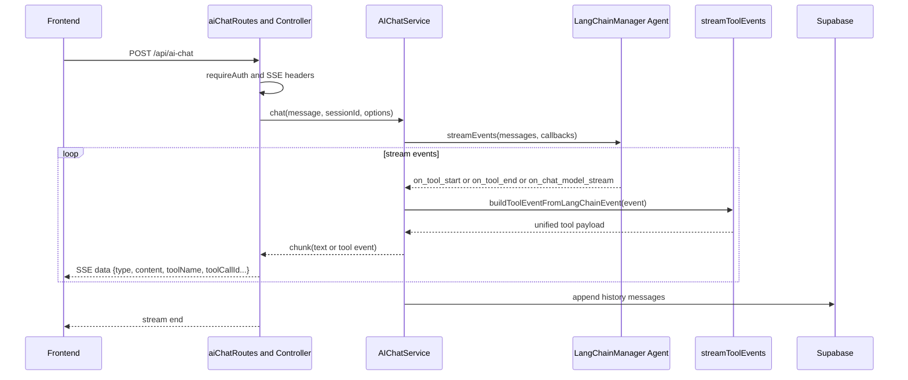
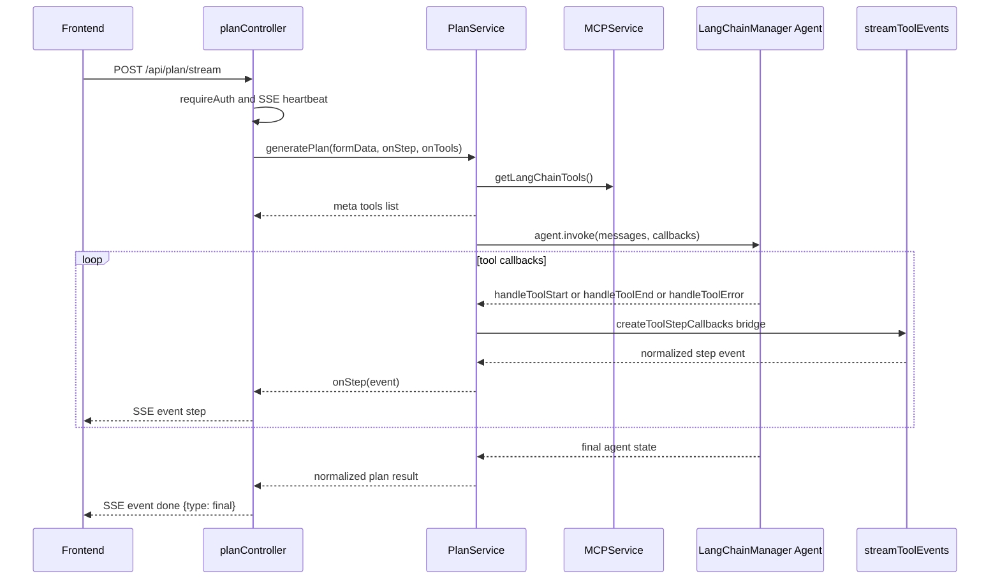
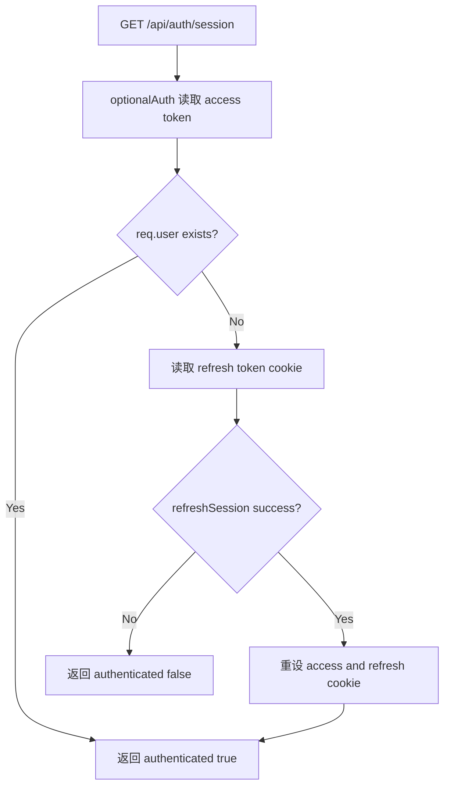

# 后端架构文档（基于当前代码）

> 更新时间：2026-03-07  
> 适用版本：当前 `backend/src` 实现

## 1. 架构目标与范围
本后端是一个以 AI 为核心的旅行应用服务层，职责是：
- 对外提供 HTTP + SSE 接口
- 承接认证、会话、AI 调用与业务编排
- 统一接入文本模型、图像模型、MCP 工具与 Supabase
- 输出可追踪、可降级、可观测的 AI 结果

本文档聚焦运行时架构、核心模块职责、关键业务流程与路由，不包含目录树和配置代码示例。

## 2. 设计原则
1. 分层清晰：`Route -> Controller -> Service -> Adapter/Infra`，避免跨层耦合。
2. 业务与基础能力分离：业务服务只做业务编排，公共能力（如工具事件规范化）抽到共享模块。
3. 统一流式协议：AI 流式输出以统一 `data.type` 语义驱动前端渲染。
4. 可降级可恢复：模型与外部能力调用支持 fallback、超时和限流保护。
5. 认证优先：除公共端点外，默认使用 `requireAuth`；会话接口支持无感恢复。
6. 可观测性优先：请求 ID、AI 元数据（provider/mcp）和错误映射贯穿全链路。

## 3. 系统架构图

## 4. 关键流程
### 4.1 AI Chat 流式对话（含工具事件）

### 4.2 AI Plan 流式规划（步骤 + 最终结果）

### 4.3 会话态获取与自动续期

## 5. 模块详解
### 5.1 接入层
- `index.js`
  - 创建 Express 应用，挂载中间件、静态资源、OpenAPI、路由。
  - 启动时初始化 `LangChainManager`、`MCPService`、各业务 Service 与 Controller。
- `middleware/logger.js`
  - 生成 `requestId`，记录请求与响应日志。
  - 输出 AI 元数据：是否 MCP、provider/model 列表。
- `middleware/auth.js`
  - `requireAuth`：必须有有效 access token。
  - 鉴权成功后会激活当前用户的 provider 运行时配置（`providerConfigService.activateUserRuntime`）。
  - `optionalAuth`：无 token 不报错，供会话探测/恢复场景使用。
- `middleware/errorHandler.js`
  - 统一异常返回，兜底 404 与 500。

### 5.2 路由与控制层
- 路由层仅负责 URL 绑定与鉴权。
- Controller 负责：参数校验、调用 service、SSE 包装、错误消息映射。
- 对 AI 流式接口：Controller 统一设置 SSE 头，写入 `meta/step/final/error` 事件。

### 5.3 业务服务层
- `aiChatService`
  - 聊天编排、历史消息读写、工具调用限流、超时/降级控制。
  - 通过 `buildToolEventFromLangChainEvent` 输出统一工具事件。
  - 支持有状态会话（`SupabaseMessageHistory`）与无状态模式。
- `planService`
  - 解析旅行信息、生成规划、结构化结果归一化。
  - 接入 MCP 工具并通过 `createToolStepCallbacks` 输出步骤流。
  - 负责规划业务的输入提示词、超时、递归限制。
- `streamToolEvents`（公共能力）
  - 工具载荷解包：`unwrapToolPayload`
  - 工具标识提取：`resolveToolName`、`resolveToolCallId`
  - 摘要生成：`summarizeToolPayload`
  - 统一事件组包：`buildToolEventPayload`
  - LangChain 事件桥接：`buildToolEventFromLangChainEvent`、`createToolStepCallbacks`
- 其他业务服务
  - `imageService`：图像生成与历史记录。
  - `promptService`：提示词与明信片文案生成。
  - `playlistService`：歌单生成与结构化清洗。
  - `postcardService`：组合 prompt + image 形成明信片。
  - `shareService`：社媒分享文案生成。
  - `ttsService`：文本转语音异步任务管理与音频文件清理。
  - `providerConfigService`：提供商配置管理（脱敏读取、密钥保留/替换、连通性校验、Supabase 持久化、热更新）。

### 5.4 AI 与外部能力层
- `LangChainManager`
  - 统一管理文本/图像/Embedding/Rerank provider 适配器。
  - 提供 provider fallback、错误探测、createAgent 能力。
  - 支持 `reload(textProviders, imageProviders, embeddingProviders, rerankProviders)` 运行时热更新。
- `OpenAICompatibleImageAdapter`
  - 通用 OpenAI-compatible 图片生成适配器（`images.generate`）。
  - `modelscope` 保持专用适配器，其他图片提供商走兼容适配器。
- `MCPService`
  - 管理 MCP 客户端连接，聚合工具列表，封装工具调用超时。
  - 将 MCP 工具转换为 LangChain `DynamicStructuredTool`。
- `supabase.js`
  - 提供数据库与鉴权客户端。
  - 在配置缺失时可回退 mock client，保证服务可启动。

## 6. 统一工具事件协议（后端输出）
工具相关事件统一包含以下字段（即使值为空也保持字段存在）：
- `source`：`chat` 或 `plan`
- `type`：`tool_call`、`tool_result`、`tool_error`
- `toolName`
- `toolCallId`
- `summary`
- `content`
- `rawContent`

`phase -> type` 固定映射：
- `call -> tool_call`
- `result -> tool_result`
- `error -> tool_error`

## 7. 路由总览
### 7.1 System
- `GET /health`
- `GET /config.js`
- `GET /api/openapi.json`
- `GET /api/docs`

### 7.2 Auth
- `POST /api/auth/register`
- `POST /api/auth/login`
- `PATCH /api/auth/profile`
- `GET /api/auth/session`
- `POST /api/auth/logout`

### 7.3 AI Chat and TTS
- `POST /api/ai-chat`
- `GET /api/mcp/status`
- `POST /api/tts`
- `GET /api/tts/audio/:task_id`
- `POST /api/ai-chat/sessions`
- `GET /api/ai-chat/sessions`
- `GET /api/ai-chat/history/:id`
- `DELETE /api/ai-chat/history/:id`
- `PATCH /api/ai-chat/sessions/:id`

### 7.4 Plan
- `POST /api/parse-travel-info`
- `POST /api/plan`
- `POST /api/plan/stream`
- `POST /api/complete-plan`
- `GET /api/plans`
- `GET /api/plans/:id`
- `POST /api/plans`
- `PATCH /api/plans/:id`
- `DELETE /api/plans/:id`

### 7.5 Content and Media
- `POST /api/generate-image`
- `GET /api/image-providers`
- `GET /api/image-history`
- `POST /api/generate-playlist`
- `GET /api/playlist-history`
- `POST /api/generate-postcard`
- `POST /api/generate-prompt`
- `POST /api/generate-postcard-prompt`
- `POST /api/generate-share-content`

### 7.6 Provider Config
- `GET /api/provider-config`
- `POST /api/provider-config/test`
- `PUT /api/provider-config`

## 8. 横切能力与约束
- 认证：业务接口默认 Cookie 鉴权，`requireAuth` 强校验。
- 会话恢复：`/auth/session` 在 access token 失效时尝试 refresh token 自动续期。
- 观测：全链路 requestId + AI provider 元数据日志。
- 错误语义：Controller 层统一将常见 AI 错误码映射为中文消息。
- 流式协议约束：前端以 `data.type` 驱动渲染，不依赖 `event` 名称。
- 配置优先级：登录用户请求时优先加载其在 Supabase 的个人 provider 配置，缺失时回退 `.env`；保存成功后立即热更新到该用户后续请求。

## 9. 当前架构重点
- 已实现 `ai-chat` 与 `ai-plan` 的工具事件公共化抽取，减少重复逻辑。
- Service 侧保留业务编排，工具解析与组包集中在 `streamToolEvents`。
- 会话接口从“未登录即 401”调整为“可探测登录态并可自动续期”，更适合前端首屏初始化。
