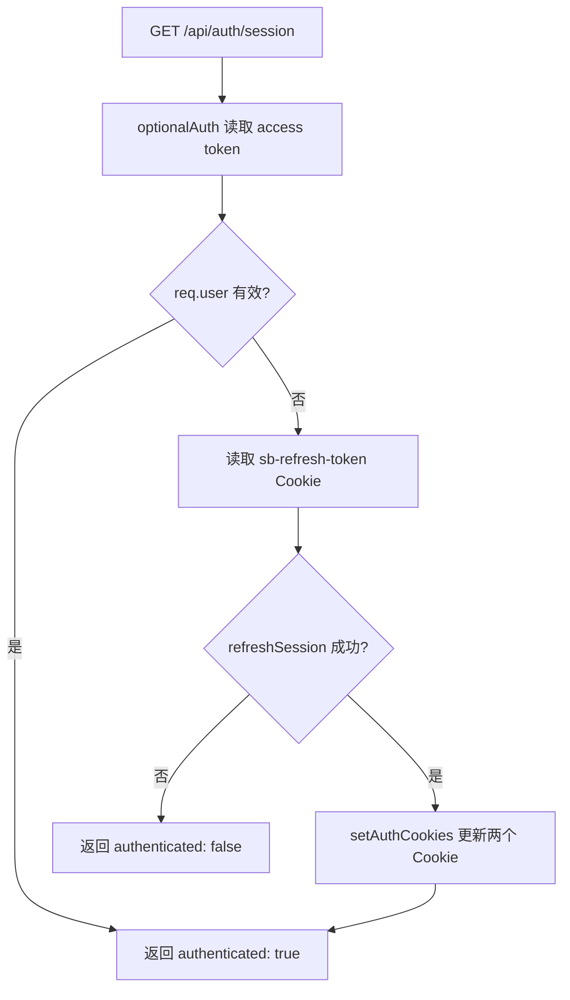

# 认证机制说明

> 更新时间：2026-03-06  
> 适用版本：当前 `backend/src` 实现  
> 相关文件：`backend/src/middleware/auth.js`、`backend/src/routes/authRoutes.js`

---

## 1. 整体设计概述

认证体系完全基于 **Supabase Auth**，后端不自行签发或验证 JWT 签名，不持有私钥。Token 通过 **HttpOnly Cookie** 在服务端与客户端之间传递，前端 JS 无法读取，天然防御 XSS 窃取。

---

## 2. Session、Access Token 与 Refresh Token 的关系

**Session 是 Token 的容器**。登录成功后 Supabase 返回完整的 Session 对象：

```json
{
  "access_token":  "eyJhbG...",
  "refresh_token": "abc123...",
  "expires_in":    3600,
  "user": { "id": "...", "email": "..." }
}
```

三者职责：

| 概念 | 职责 | 有效期 |
|---|---|---|
| **Session** | 两种 Token 的整体状态打包，登录/注册时由后端拆分写入 Cookie | — |
| **Access Token（JWT）** | 证明身份的"通行证"，每次 API 请求携带，服务端用它验证用户 | 约 1 小时 |
| **Refresh Token** | 领取新通行证的"凭条"，本身不携带权限，无法直接访问业务资源 | 30 天 |

---

## 3. Token 存储方式

登录/注册成功后，`setAuthCookies()` 将两个 Token 分别写入 HttpOnly Cookie：

| Cookie 名（默认） | 内容 | maxAge | 备注 |
|---|---|---|---|
| `sb-access-token` | JWT access token | `expires_in` 秒（约 1 小时） | 可通过 `AUTH_ACCESS_COOKIE_NAME` 覆盖 |
| `sb-refresh-token` | Refresh token | 30 天 | 可通过 `AUTH_REFRESH_COOKIE_NAME` 覆盖 |

所有 Cookie 均设置以下安全属性：
- `httpOnly: true`：前端 JS 无法读取
- `sameSite`：默认 `lax`，可通过 `AUTH_COOKIE_SAMESITE` 配置
- `secure`：生产环境默认开启，可通过 `AUTH_COOKIE_SECURE` 显式配置

> 后端 Supabase 客户端统一配置了 `autoRefreshToken: false`，禁止 SDK 自行刷新，Token 续期完全由后端路由主动控制。

---

## 4. 请求鉴权流程

`requireAuth` 中间件（`middleware/auth.js`）的完整验证链：

```
请求到达
  └── extractToken() 按优先级从 Cookie 中查找 access token
        ├── 未找到 → 401「未提供认证令牌」
        └── 找到
              └── supabase.auth.getUser(token) 远程验证
                    ├── 失败 → 401「无效的认证令牌」（含 token 前缀/长度诊断日志）
                    └── 成功 → req.user = data.user → next()
```

`optionalAuth` 行为相同，但 token 缺失或无效时不返回 401，而是将 `req.user` 设为 `null` 后继续，供会话探测等场景使用。

---

## 5. 为什么需要 refreshSession

JWT 设计为**无状态、短期有效**，过期后服务端不会自动续期。若不刷新，access token 失效后用户需重新登录。`GET /api/auth/session` 承担了**无感刷新**的职责：



刷新成功后：
- 颁发新的 access token（重新计时 1 小时）
- **同时轮换** refresh token（旧 token 立即作废，防止重放攻击）
- 两个 Cookie 同步更新

---

## 6. 认证相关 API

| 方法 | 路径 | 说明 | 鉴权 |
|---|---|---|---|
| `POST` | `/api/auth/register` | 注册并自动登录，写入 Cookie | 无 |
| `POST` | `/api/auth/login` | 密码登录，写入 Cookie | 无 |
| `GET` | `/api/auth/session` | 获取当前登录态，自动尝试 refresh | optionalAuth |
| `PATCH` | `/api/auth/profile` | 修改用户名或密码 | requireAuth |
| `POST` | `/api/auth/logout` | 清除 Cookie，退出登录 | 无 |

---

## 7. 环境变量一览

| 变量名 | 默认值 | 说明 |
|---|---|---|
| `AUTH_ACCESS_COOKIE_NAME` | `sb-access-token` | access token Cookie 名 |
| `AUTH_REFRESH_COOKIE_NAME` | `sb-refresh-token` | refresh token Cookie 名（主） |
| `AUTH_REFRESH_COOKIE_ALT_NAME` | `sb_refresh_token` | refresh token Cookie 名（备） |
| `AUTH_COOKIE_SAMESITE` | `lax` | Cookie SameSite 属性 |
| `AUTH_COOKIE_PATH` | `/` | Cookie Path |
| `AUTH_COOKIE_DOMAIN` | 空 | Cookie Domain（跨域部署时使用） |
| `AUTH_COOKIE_SECURE` | 生产环境自动 `true` | Cookie Secure 属性 |
| `AUTH_HIDE_SESSION_IN_RESPONSE` | `true` | 响应体中隐藏完整 session 对象 |

---

## 8. 设计权衡总结

| 方面 | 做法 | 原因 |
|---|---|---|
| JWT 签发 | 完全由 Supabase 负责 | 后端不持有私钥，降低密钥泄露风险 |
| Token 传输 | 仅通过 HttpOnly Cookie | 防止前端 JS 读取（XSS 防护） |
| Token 验证 | 每次请求远程调用 `getUser` | 支持服务端吊销 token |
| 自动续期 | 前端主动调 `/auth/session` | 后端无定时任务，首屏初始化时无感恢复登录态 |
| Refresh token 有效期 | 30 天 | 单独无法访问资源，安全风险低，保障长期登录体验 |
| Token 轮换 | `refreshSession` 后旧 refresh token 立即作废 | 防止 refresh token 重放攻击 |
