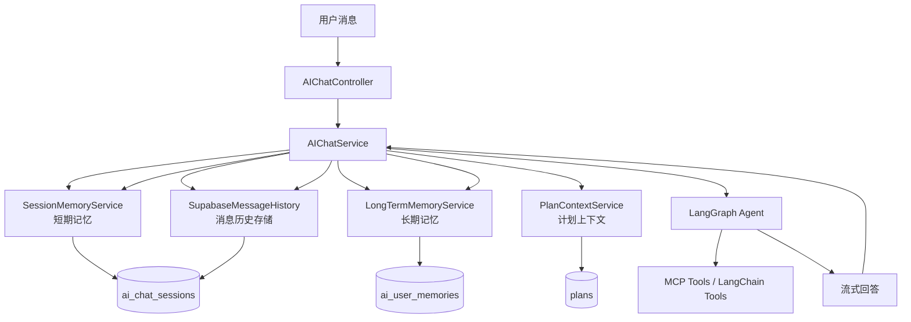
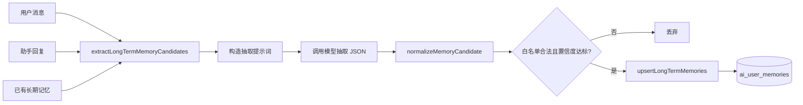
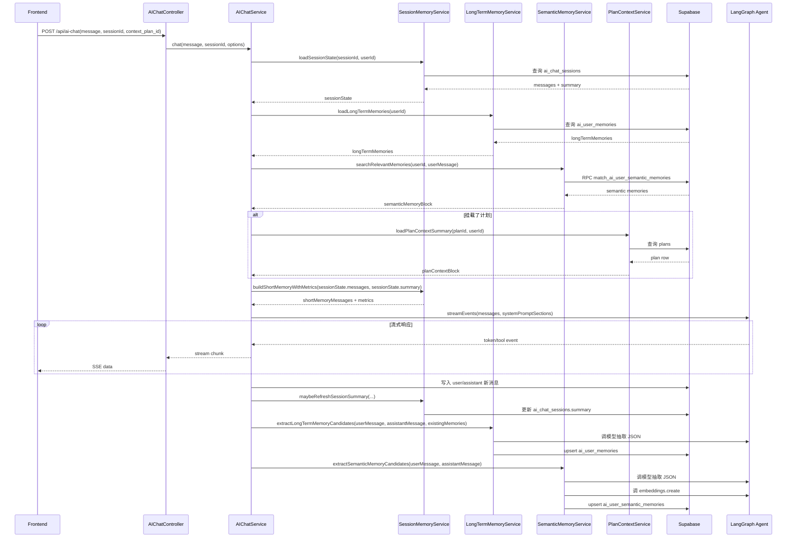
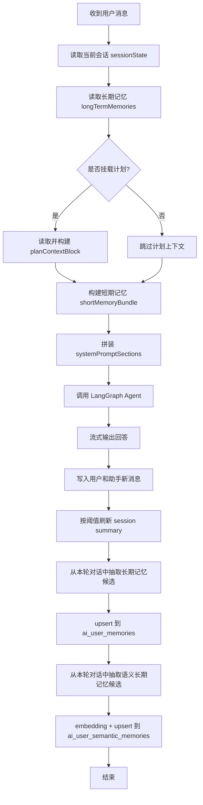

# AI 聊天 Memory 设计与实现文档

> 更新时间：2026-03-15  
> 适用范围：当前仓库中的 AI 聊天、长期记忆管理、计划上下文挂载实现  
> 相关代码：
> - backend/src/services/aiChatService.js
> - backend/src/services/ai/sessionMemoryService.js
> - backend/src/services/ai/longTermMemoryService.js
> - backend/src/services/ai/semanticMemoryService.js
> - backend/src/services/ai/planContextService.js
> - backend/src/services/langchain/SupabaseMessageHistory.js
> - frontend/src/views/AIChatView.vue
> - frontend/src/views/MemoryCenterView.vue

## 1. 文档目标

本文档完整说明当前项目中的 memory 体系，包括：

1. memory 在本项目中的定义与边界
2. 短期记忆、长期记忆、计划上下文三层结构
3. 每轮对话中 memory 的读取、拼装、更新过程
4. 数据库存储模型与接口能力
5. 与 LangChain / LangGraph 的关系
6. 为什么当前实现选择“自定义记忆策略”而不是完全依赖 LangChain 现成 memory

本文档既面向开发者，也面向后续需要优化上下文、成本、个性化能力的维护者。

---

## 2. 结论先行

当前项目中的 memory 不是单一组件，而是一套应用层自定义记忆系统。

它由三部分组成：

1. 短期记忆
  - 面向当前会话
  - 采用“会话摘要 + 最近窗口消息 + token 预算裁剪”的策略

2. 长期记忆
  - 面向当前用户的跨会话稳定偏好与语义画像
  - 采用“结构化白名单偏好 + 语义向量检索记忆 + 用户可管理”的策略

3. 计划上下文
  - 面向用户主动挂载的旅行计划
  - 把具体计划摘要作为持续上下文注入当前会话

LangChain / LangGraph 在本项目中主要承担以下角色：

1. 统一消息对象模型
2. Agent 执行框架
3. 工具调用与流式事件框架
4. Chat history 抽象接口

真正的记忆策略、记忆结构、数据库模型、提取规则、裁剪规则、前端管理能力，都由项目自己实现。

---

## 3. 设计目标

当前 memory 体系主要服务以下目标：

1. 提升 AI 对上下文的持续理解能力
2. 控制上下文长度和模型成本
3. 将“聊天记录”升级为“可复用的结构化用户偏好”
4. 将用户选择的旅行计划作为稳定上下文挂载到会话中
5. 保证多用户隔离、可审计、可管理、可扩展

对应地，系统不采用“把所有对话历史原样塞给模型”的做法，而是采用可裁剪、可摘要、可持久化、可人工干预的工程化方案。

---

## 4. Memory 总体架构

### 4.1 架构图



### 4.2 分层解释

#### 应用编排层
- AIChatService 是 memory 的总装配器。
- 它负责在每轮对话前读取各种记忆，在每轮对话后更新各种记忆。

#### 短期记忆层
- SessionMemoryService 负责当前会话级别的上下文压缩与摘要。

#### 长期记忆层
- LongTermMemoryService 负责用户偏好型记忆的结构化提取、格式化、保存与删除。
- SemanticMemoryService 负责语义画像记忆的抽取、embedding、向量检索与画像聚合。

#### 业务上下文层
- PlanContextService 负责把用户选择的旅行计划转成稳定可注入的上下文块。

#### 存储层
- ai_chat_sessions 存储消息历史与会话摘要。
- ai_user_memories 存储长期偏好。
- ai_user_semantic_memories 存储可向量检索的语义画像记忆。
- plans 提供可挂载的计划上下文源数据。

#### 执行层
- LangGraph Agent 负责推理、工具调用、流式返回。
- 它并不定义本项目的记忆策略，只消费已经准备好的上下文。

---

## 5. 三层 Memory 详细设计

## 5.0 每个 Memory 是怎么做的（速查矩阵）

| 维度 | 短期记忆（SessionMemoryService） | 结构化长期记忆（LongTermMemoryService） | 语义长期记忆（SemanticMemoryService） | 计划上下文（PlanContextService） |
| --- | --- | --- | --- | --- |
| 目标 | 保留当前会话有效上下文并控长 | 沉淀跨会话稳定偏好 | 沉淀弱结构化用户画像并可相似召回 | 将用户选中的计划持续注入会话 |
| 读取时机 | 每轮聊天开始 | 每轮聊天开始 | 每轮聊天开始（按当前消息检索） | `context_plan_id` 生效时 |
| 写入时机 | 每轮结束写消息；达到阈值写摘要 | 每轮结束后抽取并 upsert；也支持手工增删改 | 每轮结束后抽取、向量化并 upsert | 不写入记忆表，仅从 `plans` 读取并格式化 |
| 入模形式 | `messages`（summary 前缀 + recent window + token trim） | system prompt 文本块 | system prompt 文本块（Top-K 召回） | system prompt 文本块 |
| 主要存储 | `ai_chat_sessions.messages/summary` | `ai_user_memories` | `ai_user_semantic_memories` + RPC 检索 | `plans` |
| 核心约束 | 最大窗口 + token 预算 + 摘要触发阈值 | `memory_key` 白名单 + 置信度阈值 + `UNIQUE(user_id,memory_key)` | `memory_type` 白名单 + 指纹去重 + 相似度阈值 + Top-K | 必须按 `user_id` 校验归属 |
| 可观测性 | 输出 `short_memory` 与 token 估算 metrics | 管理页可编辑/删除/清空 | `profile` 聚合（tags/highlights/stats）+ recall 计数 | 由挂载参数与计划摘要可见 |

一句话：**短期记忆管“最近聊了什么”，结构化长期记忆管“明确偏好”，语义长期记忆管“隐性画像”，计划上下文管“当前业务背景”。**

## 5.1 短期记忆

### 5.1.1 目标

短期记忆用于让模型理解“当前这段会话的近期上下文”，同时避免上下文无限膨胀。

### 5.1.2 负责模块

- backend/src/services/ai/sessionMemoryService.js

### 5.1.3 关键策略

短期记忆不是完整历史，而是：

1. 会话摘要
2. 最近窗口消息
3. token 预算裁剪

即：

```text
入模短期上下文 = summary + recent_messages_within_window + token_budget_trim
```

### 5.1.4 核心方法

#### shortMemoryConfig
负责读取环境配置：

- AI_CHAT_SHORT_MEMORY_ENABLED
- AI_CHAT_SHORT_MEMORY_MAX_MESSAGES
- AI_CHAT_SHORT_MEMORY_TOKEN_BUDGET
- AI_CHAT_SESSION_SUMMARY_TRIGGER_MESSAGES

#### loadSessionState
从 ai_chat_sessions 中读取：

- messages
- summary
- summary_updated_at

并将原始记录转为 LangChain 消息对象。

#### buildShortMemoryWithMetrics
这是短期记忆的核心逻辑：

1. 若存在 summary，则先构造一个 SystemMessage 作为摘要前缀
2. 从历史消息中只保留最近 maxMessages 条
3. 再根据 tokenBudget 继续裁剪
4. 返回：
  - messages：实际入模消息
  - metrics：上下文估算指标

#### maybeRefreshSessionSummary
当消息数达到阈值时：

1. 将较早的消息切出一段
2. 调用模型进行摘要压缩
3. 把结果写回 ai_chat_sessions.summary

#### generateSessionSummary
通过模型生成结构化中文摘要，聚焦：

1. 用户偏好
2. 已确认事实
3. 约束条件
4. 待办项

### 5.1.5 设计收益

1. 保证会话越长也不会无限占用上下文
2. 保持对近期轮次的较高保真度
3. 能向前端提供上下文可观测性指标

### 5.1.6 关键配置

```env
AI_CHAT_SHORT_MEMORY_ENABLED=true
AI_CHAT_SHORT_MEMORY_MAX_MESSAGES=12
AI_CHAT_SHORT_MEMORY_TOKEN_BUDGET=6000
AI_CHAT_SESSION_SUMMARY_TRIGGER_MESSAGES=24
```

---

## 5.2 长期记忆

### 5.2.1 目标

长期记忆用于保存跨会话稳定有效的用户偏好，而不是临时聊天内容。

它的本质不是“长聊天记录”，而是“结构化用户偏好画像”。

当前实现中，长期记忆已经拆成两层：

1. 结构化长期记忆
  - 仍然使用固定白名单 `memory_key`
  - 适合预算、节奏、交通、住宿等强字段偏好

2. 语义长期记忆
  - 使用 `pgvector` + embeddings 做向量检索
  - 适合经验、约束、兴趣、主题倾向等弱结构化画像

### 5.2.2 负责模块

- backend/src/services/ai/longTermMemoryService.js

### 5.2.3 白名单设计

当前只允许以下 memory_key 被保存：

1. budget_preference
2. travel_pace
3. transport_preference
4. accommodation_preference
5. food_preference
6. destination_preference
7. taboo

这样做的原因是：

1. 防止模型把无意义对话误存为长期记忆
2. 保证长期记忆是强业务语义字段
3. 便于前端做固定分类管理页

### 5.2.4 核心方法

#### loadLongTermMemories
从 ai_user_memories 读取当前用户长期偏好。

#### formatLongTermMemoryBlock
把结构化记忆转成 system prompt 可消费的文本块，例如：

```text
以下是用户的长期偏好记忆（跨会话）：
- budget_preference: ...
- travel_pace: ...
```

#### extractLongTermMemoryCandidates
在一轮对话完成后，调用模型进行偏好抽取：

输入包括：
- 用户消息
- 助手回复
- 已有记忆

要求模型：
- 只输出 JSON
- 只允许白名单 key
- 不要编造
- 无可提取内容时输出空数组

#### normalizeMemoryCandidate
对模型返回的数据做清洗与校验：

1. key 是否在白名单中
2. value 是否存在
3. confidence 是否合法

#### upsertLongTermMemories
按 user_id + memory_key 做 upsert，意味着：

1. 同一用户同一类偏好只保留一条
2. 新值会覆盖旧值
3. 不会无限堆积重复偏好

#### saveLongTermMemory / deleteLongTermMemory / clearLongTermMemories
用于前端人工管理页：

1. 手动保存某个偏好
2. 删除某个偏好
3. 清空全部偏好

### 5.2.5 长期记忆抽取逻辑图



### 5.2.6 设计收益

1. 让 AI 具备跨会话的个性化能力
2. 从自由文本聊天记录中沉淀结构化偏好
3. 支持人工管理和自动抽取并存

### 5.2.7 关键配置

```env
AI_CHAT_LONG_MEMORY_ENABLED=true
AI_CHAT_LONG_MEMORY_MIN_CONFIDENCE=0.75
AI_CHAT_SEMANTIC_MEMORY_ENABLED=true
AI_CHAT_SEMANTIC_MEMORY_TOP_K=3
AI_CHAT_SEMANTIC_MEMORY_MIN_SIMILARITY=0.65
AI_CHAT_SEMANTIC_MEMORY_MAX_ITEMS_PER_TURN=3
AI_EMBEDDING_BASE_URL=https://api-inference.modelscope.cn/v1
AI_EMBEDDING_MODEL=Qwen/Qwen3-Embedding-8B
AI_EMBEDDING_API_KEY=
```

### 5.2.8 语义画像记忆层

语义画像记忆由 `SemanticMemoryService` 负责，核心能力包括：

1. 对每轮对话做语义长期记忆抽取
  - 只允许 `preference / constraint / experience / interest`
  - 过滤低置信度、一次性任务和临时安排

2. 调用 ModelScope OpenAI-compatible embeddings
  - 默认 `https://api-inference.modelscope.cn/v1`
  - 默认模型 `Qwen/Qwen3-Embedding-8B`
  - 默认复用当前激活的 ModelScope 文本 provider token

3. 写入 `ai_user_semantic_memories`
  - 以 `user_id + memory_fingerprint` 做 upsert
  - 每条记录包含 `memory_text`、`memory_type`、`tags`、`salience`、`embedding`

4. 聊天前做向量召回
  - 只基于当前用户消息生成 query embedding
  - 通过 Supabase RPC `match_ai_user_semantic_memories(...)` 召回 Top-K 相关语义记忆
  - 把结果格式化成 `semantic_memory_block` 注入 system prompt

5. 聚合只读画像
  - 对外提供 `summary`、`tags`、`highlights`、`recent_memories`、`stats`
  - 供长期记忆中心页面展示“AI 语义画像”

---

## 5.3 计划上下文

### 5.3.1 目标

计划上下文不是传统意义上的 memory，但在运行时承担“会话持续上下文”的职责。

它解决的问题是：

用户在 AI 对话中选择一个旅行计划，希望后续多轮对话都以这份计划为参照。

### 5.3.2 负责模块

- backend/src/services/ai/planContextService.js

### 5.3.3 核心方法

#### loadPlanContextSummary
按计划 ID 和 user_id 读取 plans 表中的计划数据。

#### buildPlanContextSummaryFromRow
把原始计划转成一段结构化上下文，尽量完整覆盖：

1. 目的地
2. 天数
3. 预算
4. 人数
5. 偏好
6. 每日行程
7. 酒店
8. 活动
9. 交通建议
10. 预算分解
11. 贴士

### 5.3.4 关键特点

1. 必须校验 user_id，防止跨用户越权挂载
2. 不只是计划标题，而是完整压缩摘要
3. 被持续拼进 system prompt，直到前端取消挂载

### 5.3.5 设计收益

1. 让 AI 在后续多轮对话中持续“记住当前计划”
2. 避免用户每轮都重新粘贴旅行方案
3. 让聊天和结构化规划能力真正联动

---

## 6. 数据模型设计

## 6.1 ai_chat_sessions

作用：

1. 存储原始消息历史
2. 存储会话摘要
3. 作为短期记忆的基础数据源

关键字段：

- conversation_id
- user_id
- messages
- summary
- summary_updated_at

## 6.2 ai_user_memories

作用：

1. 存储用户的长期偏好
2. 提供跨会话画像能力
3. 支持人工管理

关键字段：

- id
- user_id
- memory_key
- memory_value
- confidence
- source_session_id
- created_at
- updated_at

关键约束：

```text
UNIQUE(user_id, memory_key)
```

这意味着长期记忆按“类别”覆盖更新，而不是堆叠追加。

## 6.3 ai_user_semantic_memories

作用：

1. 存储用户弱结构化长期画像
2. 支持向量检索召回
3. 支持只读画像聚合展示

关键字段：

- id
- user_id
- memory_text
- memory_type
- tags
- confidence
- salience
- source_session_id
- memory_fingerprint
- recall_count
- last_recalled_at
- metadata
- embedding
- created_at
- updated_at

其中 `embedding` 实际使用 `halfvec(4000)`，并且 embeddings 接口显式请求 `dimensions=4000`。原因是当前采用的 `Qwen/Qwen3-Embedding-8B` 原始输出为 4096 维，而 `pgvector` 的 `ivfflat` 对普通 `vector` 索引上限为 2000 维，对 `halfvec` 索引上限为 4000 维。

关键约束：

```text
UNIQUE(user_id, memory_fingerprint)
```

关键 RPC：

```sql
match_ai_user_semantic_memories(query_embedding, query_user_id, match_count, min_similarity)
```

## 6.4 plans

作用：

1. 作为计划上下文的原始数据源
2. 被挂载进会话时，转成持续上下文块

---

## 7. 一轮对话中的 Memory 生命周期

## 7.1 顺序说明

每次 POST /api/ai-chat 时，memory 相关流程如下：

1. 读取当前会话状态
2. 读取当前用户长期记忆
3. 基于当前用户消息召回语义长期记忆
4. 如果有挂载计划，则读取计划上下文
5. 组装 system prompt
6. 构造短期记忆消息
7. 调用 LangGraph Agent
8. 流式返回回答
9. 回写新消息到 ai_chat_sessions
10. 按阈值刷新会话摘要
11. 抽取并更新结构化长期记忆
12. 抽取并更新语义长期记忆

## 7.2 时序图



---

## 8. AIChatService 中的上下文组装方式

AIChatService 中 system prompt 的拼装逻辑大致为：

```text
systemPromptSections = [
  base_system_prompt,
  tool_rules_if_enabled,
  long_term_memory_block,
  semantic_memory_block,
  plan_context_block,
]
```

之后真正给 Agent 的输入为：

```text
messages = short_memory_messages + current_user_message
system_prompt = systemPromptSections.join("\n\n")
```

这意味着：

1. 长期记忆和计划上下文不作为普通对话消息传入
2. 它们以“高优先级系统上下文”的形式注入
3. 会话级短期记忆仍然作为消息列表参与推理

这种分工非常重要，因为：

1. 短期记忆适合保留对话顺序语义
2. 长期记忆适合保留稳定用户画像
3. 计划上下文适合保留结构化业务背景

---

## 9. 前端是如何消费 Memory 能力的

## 9.1 AIChatView

前端 AI 聊天页包含两类 memory 相关能力：

1. 会话历史管理
2. 上下文估算指标展示

其中上下文估算来自后端返回的 memory_metrics 流事件，包括：

1. prompt_tokens_estimate
2. system_tokens_estimate
3. history_tokens_estimate
4. user_tokens_estimate
5. long_term_memory_count
6. short_memory_compressed
7. short_memory 细项指标
8. semantic_memory_count
9. semantic_memory_retrieved
10. semantic_memory_tokens_estimate

## 9.2 MemoryCenterView

前端长期记忆管理页提供了：

1. 查询全部长期记忆
2. 按固定 memory_key 编辑
3. 删除单个长期记忆
4. 清空全部长期记忆

当前 UI 是固定类别面板，不是无限新增列表，这与数据库唯一键设计保持一致。

---

## 10. API 设计

## 10.1 聊天接口

### POST /api/ai-chat

主要与 memory 相关的字段：

- message
- sessionId
- context_plan_id
- context_plan_enabled
- enable_tools

## 10.2 长期记忆接口

### GET /api/ai-chat/memory
- 获取当前用户全部长期记忆

### GET /api/ai-chat/memory/profile
- 获取当前用户的结构化长期记忆 + 语义画像摘要

### PUT /api/ai-chat/memory/:key
- 保存当前用户某一类长期记忆

### DELETE /api/ai-chat/memory/:key
- 删除当前用户某一类长期记忆

### DELETE /api/ai-chat/memory
- 清空当前用户全部长期记忆

---

## 11. 与 LangChain / LangGraph 的关系

## 11.1 当前项目实际上用了什么

### LangChain / LangGraph 提供的能力

1. 消息对象
  - HumanMessage
  - AIMessage
  - SystemMessage
  - ToolMessage

2. Chat History 抽象
  - BaseChatMessageHistory

3. Agent 执行框架
  - createReactAgent

4. 工具与事件流
  - streamEvents
  - callback 体系
  - tool call / tool result 事件

### 项目自己实现的能力

1. Supabase 持久化历史
2. 短期记忆摘要与 token 裁剪
3. 长期偏好结构化抽取
4. 计划上下文挂载
5. 长期记忆管理接口与前端页面

## 11.2 为什么不是直接用 LangChain 自带 memory

原因主要有五个：

### 1. 业务语义更强
这里的 memory 不是纯聊天历史，而是：

1. 当前会话摘要
2. 用户长期偏好
3. 旅行计划上下文

通用 memory 组件无法直接表达这三层语义。

### 2. 需要结构化长期记忆
长期记忆必须满足：

1. 固定白名单 key
2. confidence 过滤
3. upsert 覆盖
4. 可人工管理

这类能力更适合项目自行定义。

### 3. 需要数据库与用户权限强绑定
系统要求：

1. 按 user_id 隔离
2. 由 Supabase 持久化
3. 前端可查看、编辑、删除

这已经超出通用 memory 类的职责。

### 4. 需要精细的 token 成本控制
短期记忆中需要：

1. 最近窗口
2. 自动摘要
3. token budget 裁剪
4. metrics 可观测

这类策略在本项目里是自定义的。

### 5. 当前 LangGraph 推荐路线本来就更偏“应用自己管理 state”
对于复杂多轮 Agent，LangGraph 更强调：

1. state
2. checkpointer
3. app-specific memory

而不是传统意义上一挂就用的 ConversationBufferMemory。

---

## 12. LangChain 现成 Memory 能力在本项目中的对应关系

## 12.1 可对标的通用能力

如果用通用概念映射，本项目大致对应：

1. SessionMemoryService
  - 类似 ConversationSummaryBufferMemory 的思路
  - 但实现更可控，并且带 metrics

2. SupabaseMessageHistory
  - 类似自定义 BaseChatMessageHistory 持久化实现

3. LongTermMemoryService
  - 类似“结构化用户画像 memory”
  - 这不是 LangChain 开箱直接定义好的能力

4. PlanContextService
  - 更接近业务态 context injection，而非通用 memory

## 12.2 为什么 MemorySaver 没成为主角

在 LangChainManager 中可以看到对 MemorySaver 的引入，但当前主流程没有把它作为整个 memory 体系的核心。

原因是：

1. MemorySaver 更偏线程状态 checkpoint
2. 适合图执行状态保存
3. 不直接等于用户长期偏好管理系统
4. 不直接解决数据库持久化、用户隔离、前端管理页等需求

所以它不是不能用，而是它解决的问题层级不同。

---

## 13. 一轮对话的流程图



---

## 14. 当前实现的优点

1. 分层清晰
  - 短期、长期、业务上下文各自职责明确

2. 工程上可控
  - token 成本、摘要阈值、白名单和权限控制都可调

3. 易于和业务融合
  - 可直接接旅行计划、用户偏好管理页、后续推荐系统

4. 便于前端可视化
  - 可以展示上下文估算与长期记忆内容

5. 可逐步扩展
  - 后续可新增更多 memory_key、向量检索层、标签体系、偏好权重体系

---

## 15. 当前限制与后续演进建议

## 15.1 当前限制

1. 长期记忆仍然是白名单键值模型，表达力有限
2. 短期记忆摘要依赖模型生成，存在摘要偏差风险
3. 语义画像记忆依赖 embeddings 接口，若 ModelScope token 不可用会自动降级关闭
4. 计划上下文刷新后不会自动版本对齐到历史会话快照
5. 当前主要是文本级偏好，没有更细粒度的偏好权重系统

## 15.2 后续建议

### 方向一：语义记忆质量治理
可以继续增强：

1. 语义记忆压缩与合并
2. 相似记忆冲突检测
3. 召回质量评估

### 方向三：摘要质量治理
可以增加：

1. 摘要长度限制
2. 摘要质量评估
3. 摘要覆盖度测试

### 方向四：计划上下文版本化
将计划挂载时的上下文摘要做会话快照，避免后续原计划变化导致会话语义漂移。

---

## 16. 维护者速查

### 想调短期记忆窗口大小
修改：

- AI_CHAT_SHORT_MEMORY_MAX_MESSAGES
- AI_CHAT_SHORT_MEMORY_TOKEN_BUDGET

### 想调摘要触发时机
修改：

- AI_CHAT_SESSION_SUMMARY_TRIGGER_MESSAGES

### 想新增一种长期记忆类型
至少需要同步修改：

1. longMemoryWhitelist
2. 前端管理页 MemoryCenterView
3. 相关文案与示例

### 想关闭长期记忆自动抽取
修改：

- AI_CHAT_LONG_MEMORY_ENABLED=false

### 想排查上下文为什么太长
看：

1. 前端 memory metrics
2. SessionMemoryService 的 selected_tokens_estimate
3. 是否挂载了较大的计划上下文

---

## 17. 总结

当前项目中的 memory 不是单点组件，而是一个围绕 AI 聊天能力搭建的上下文系统。

它把“记忆”拆成了三个维度：

1. 会话级短期记忆
2. 用户级长期偏好记忆
3. 业务级计划上下文记忆

LangChain / LangGraph 为这套系统提供了消息抽象、Agent 执行、工具调用和流式框架；真正决定“记什么、怎么压缩、怎么落库、怎么展示、怎么管理”的，是项目自己的应用层实现。

这也是当前实现最重要的特点：

它不是一个通用聊天 demo 的 memory，而是一个真正面向业务、可观测、可管理、可扩展的 memory 体系。
