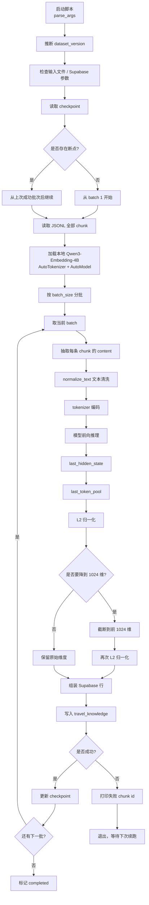
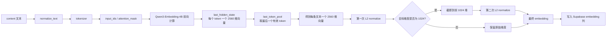

# RAG Embedding 入库流程说明

本文说明 [`backend/scripts/ingest_local_qwen.py`](/home/wushiwei/projects_z/cdy/RAG/ai-travel-planner/backend/scripts/ingest_local_qwen.py) 中本地 Qwen Embedding 入库 Supabase 的实际流程，重点展开 embedding 相关操作。

## 整体流程



## Embedding 部分的具体含义

### 1. 从每个 chunk 里只取 `content`

原始 JSONL 里每条数据通常有这些字段：

- `city`
- `type`
- `title`
- `tags`
- `sourceUrl`
- `content`

脚本在做 embedding 时，只把 `content` 拿出来送进模型。

原因是：

- `content` 才是主要语义正文
- `city`、`title`、`tags` 更适合作为过滤条件和展示字段
- 如果把所有元信息一起拼进去，向量会混入很多非正文信号

所以当前设计是：

- `content` 负责生成语义向量
- 其他字段照样入库，但不参与 embedding

### 2. 先做文本清洗

脚本会对 `content` 先执行 `normalize_text()`。

这一步主要不是“润色文本”，而是“确保输入对 tokenizer 合法”。

当前清洗内容包括：

- `None` 转为空字符串
- 非字符串类型转成字符串
- 去掉孤立的 Unicode 代理字符，比如 `\udcb0`、`\udd58`
- 去掉首尾空白

之所以需要这一步，是因为：

- Python 本身能容忍一些坏字符
- 但 `transformers` 底层 fast tokenizer 对非法 Unicode 往往不稳定
- 如果不先清洗，可能直接在 tokenizer 阶段报错

### 3. tokenizer 把文本变成 token

清洗后的文本会送进：

```python
tokenizer(
    texts,
    padding=True,
    truncation=True,
    max_length=8192,
    return_tensors="pt",
)
```

这一步做了几件事：

- 把文本按模型词表切成 token
- 把 token 映射成整数 id，也就是 `input_ids`
- 生成 `attention_mask`，标记哪些位置是真实 token，哪些是 padding
- 对同一批不同长度文本进行补齐
- 对太长文本按 `max_length` 截断

这里要注意：

- `max_length=8192` 是 tokenizer 的截断上限
- 它不是 chunk 切分长度
- 它只决定“最多让多少 token 进入模型”

所以：

- chunk 切分是上游数据处理策略
- `max_length` 是模型前处理阶段的安全上限

### 4. Qwen 模型输出每个 token 的 hidden states

接着执行模型前向：

```python
outputs = self.model(**tokenized)
```

真正用于 embedding 的是：

```python
outputs.last_hidden_state
```

它可以理解成一个三维张量：

```text
[batch_size, seq_len, hidden_size]
```

含义分别是：

- `batch_size`：这一批有多少条文本
- `seq_len`：补齐后的 token 序列长度
- `hidden_size`：每个 token 的表示维度

对 `Qwen3-Embedding-4B` 来说，`hidden_size` 是 `2560`。

也就是说，这一步拿到的还不是“每条文本一个向量”，而是：

- 每条文本里
- 每个 token
- 都有一个 2560 维表示

### 5. 用 `last_token_pool` 取句向量

因为最终要存的是“每条文本一个 embedding”，所以要从 token 级表示压缩成句子级表示。

当前脚本使用的是 Qwen 官方推荐的 `last_token_pool`。

它的逻辑是：

- 如果使用左侧 padding，那么最后一个位置就是最后一个有效 token
- 如果不是左侧 padding，就根据 `attention_mask` 找到每条文本真正的最后一个 token
- 取那个 token 对应的 hidden state，作为整条文本的表示

所以张量形状会从：

```text
[batch_size, seq_len, 2560]
```

变成：

```text
[batch_size, 2560]
```

这一步之后，才得到“每条文本一个向量”。

### 6. 第一次 L2 归一化

取到句向量后，脚本会先做一次：

```python
embeddings = F.normalize(embeddings, p=2, dim=1)
```

也就是 L2 归一化。

它的作用是把每个向量缩放到长度为 1。

这样做的好处：

- 后面做余弦相似度检索更稳定
- 向量长度差异不会干扰检索
- 更符合 embedding 检索的常见做法

此时你得到的是：

- 每条文本一个向量
- 每个向量维度是 2560
- 每个向量都已归一化

### 7. 如果需要，把 2560 维截到 1024 维

你的表结构在 [`rag-setup.sql`](/home/wushiwei/projects_z/cdy/RAG/ai-travel-planner/rag-setup.sql) 里定义的是：

```sql
embedding VECTOR(1024)
```

但 `Qwen3-Embedding-4B` 的原始输出维度是 `2560`。

所以脚本会判断：

- 如果当前配置的 `dim=1024`
- 并且模型输出维度大于 1024
- 就只保留前 1024 维

对应代码逻辑就是：

```python
embeddings = embeddings[:, : self.dim]
```

这不是随便裁掉，而是利用 Qwen3-Embedding 支持的 Matryoshka-style truncation 思路：

- 前部维度保留主要语义信息
- 可以在性能、存储、检索速度之间做折中

### 8. 第二次 L2 归一化

向量截断以后，长度又变了，所以脚本会再做一次归一化：

```python
embeddings = F.normalize(embeddings, p=2, dim=1)
```

这一步非常重要。

因为如果你：

- 先归一化成 2560 维单位向量
- 再直接裁成 1024 维

那么裁完以后它就不再是单位向量了。

所以必须再归一化一次，保证最终写进库里的 1024 维向量仍然适合做余弦相似度检索。

### 9. 写入 Supabase 的 `embedding` 列

最后，脚本会把每条 chunk 组装成数据库行，包括：

- `kb_slug`
- `dataset_version`
- `external_id`
- `city`
- `type`
- `title`
- `content`
- `metadata`
- `embedding`

其中：

- `embedding` 是最终得到的 1024 维浮点向量
- 对应 Supabase 里 `travel_knowledge.embedding VECTOR(1024)` 这一列

写入时通过 PostgREST 调用 Supabase：

- 成功则更新本地 checkpoint
- 失败则打印这一批的 `chunk id`
- 下次启动时可以从断点继续

## Embedding 部分的单独视图



## 一句话总结

当前 embedding 流程本质上是在做这件事：

1. 取正文 `content`
2. 清洗成合法文本
3. tokenizer 转成 token
4. 模型为每个 token 计算 hidden state
5. 取最后一个有效 token 作为整段文本的表示
6. 归一化
7. 从 2560 维压到 1024 维
8. 再归一化
9. 存进 Supabase 的 `embedding` 列
