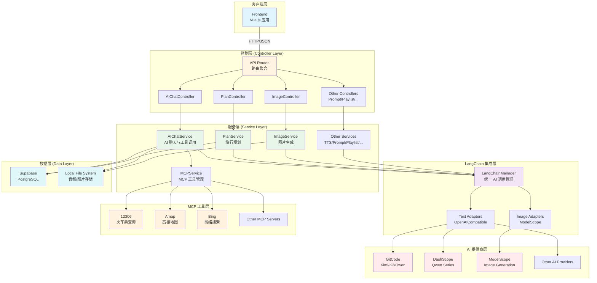

# AI 旅行规划系统 - 后端架构文档

## 📋 目录

- [系统概述](#系统概述)
- [技术栈](#技术栈)
- [目录结构](#目录结构)
- [核心架构设计](#核心架构设计)
- [模块详解](#模块详解)
- [AI 服务集成](#ai-服务集成)
- [MCP 工具集成](#mcp-工具集成)
- [API 路由设计](#api-路由设计)
- [配置管理](#配置管理)
- [错误处理](#错误处理)
- [性能优化](#性能优化)
- [部署指南](#部署指南)

---

## 系统概述

### 项目定位
AI 旅行规划系统（拾光绘旅）是一个基于 AI 的智能旅行规划 Web 应用的后端服务，采用现代化技术栈和模块化设计，提供灵活的 AI 服务集成和强大的旅行规划功能。

### 核心特性
- ✅ **统一的 AI 服务管理**：通过 LangChain 统一管理多个 AI 提供商
- ✅ **多提供商降级策略**：支持多个文本/图片提供商的自动降级
- ✅ **MCP 工具集成**：集成 MCP（Model Context Protocol）工具链
- ✅ **智能旅行规划**：基于 AI 的行程生成和预算管理
- ✅ **多媒体生成**：支持图片生成、语音合成、歌单推荐等
- ✅ **会话管理**：基于 Supabase 的用户认证和数据持久化
- ✅ **错误追踪**：完整的错误处理和追踪机制

---

## 技术栈

### 核心框架
- **Express.js 5.x** - Web 应用框架
- **Node.js >= 18.0.0** - 运行时环境

### AI & LangChain
- **LangChain 1.2.x** - AI 应用开发框架
- **LangGraph 1.1.x** - 有状态 AI 应用的图表示框架
- **@langchain/core 1.1.x** - LangChain 核心库
- **@langchain/openai 1.2.x** - OpenAI 集成
- **@modelcontextprotocol/sdk 1.23.x** - MCP SDK

### 数据存储
- **Supabase.js 2.86.x** - PostgreSQL 数据库客户端
- **PostgreSQL** - 关系型数据库（通过 Supabase）

### 工具库
- **zod 4.3.x** - 数据验证和类型推断
- **openai 6.6.x** - OpenAI API 客户端
- **dotenv 17.2.x** - 环境变量管理
- **cors 2.8.x** - 跨域资源共享

---

## 目录结构

```
backend/src/
├── index.js                    # 应用入口文件
├── supabase.js                 # Supabase 客户端初始化
│
├── config/                     # 配置管理
│   └── index.js               # 环境变量和配置管理
│
├── controllers/                # 控制器层（HTTP 请求处理）
│   ├── aiChatController.js    # AI 聊天控制器
│   ├── imageController.js     # 图片生成控制器
│   ├── planController.js      # 旅行规划控制器
│   ├── playlistController.js  # BGM 歌单控制器
│   ├── postcardController.js  # 明信片控制器
│   ├── promptController.js    # 提示词控制器
│   └── shareController.js     # 分享文案控制器
│
├── routes/                     # 路由层（API 端点定义）
│   ├── index.js               # 路由聚合
│   ├── aiChatRoutes.js        # AI 聊天路由
│   ├── imageRoutes.js         # 图片生成路由
│   ├── planRoutes.js          # 旅行规划路由
│   ├── playlistRoutes.js      # BGM 歌单路由
│   ├── postcardRoutes.js      # 明信片路由
│   ├── promptRoutes.js         # 提示词路由
│   └── shareRoutes.js         # 分享文案路由
│
├── services/                   # 业务逻辑层
│   ├── aiChatService.js       # AI 聊天服务（核心）
│   ├── imageService.js        # 图片生成服务
│   ├── mcpService.js          # MCP 工具服务
│   ├── planService.js         # 旅行规划服务
│   ├── playlistService.js     # BGM 歌单服务
│   ├── postcardService.js     # 明信片服务
│   ├── promptService.js       # 提示词优化服务
│   ├── shareService.js        # 分享文案服务
│   ├── ttsService.js          # 语音合成服务
│   │
│   └── langchain/             # LangChain 集成层
│       ├── LangChainManager.js  # LangChain 管理器（核心）
│       ├── base/              # 基础适配器
│       │   ├── BaseImageAdapter.js
│       │   ├── BaseLLMAdapter.js
│       │   └── interfaces.js
│       ├── image/             # 图片生成适配器
│       │   └── ModelScopeImageAdapter.js
│       └── text/              # 文本生成适配器
│           └── OpenAICompatibleAdapter.js
│
├── middleware/                 # 中间件
│   ├── errorHandler.js        # 错误处理中间件
│   └── logger.js              # 请求日志中间件
│
└── utils/                      # 工具函数
    ├── helpers.js             # 通用辅助函数
    ├── logger.js              # 日志工具
    └── sensitiveFilter.js    # 敏感信息过滤
```

---

## 核心架构设计

### 分层架构

```
┌─────────────────────────────────────────────────────────┐
│                   Client (Frontend)                      │
└────────────────────┬────────────────────────────────────┘
                     │ HTTP/JSON
┌────────────────────▼────────────────────────────────────┐
│              Controller Layer (路由+控制器)               │
│  - 接收 HTTP 请求                                        │
│  - 参数验证                                              │
│  - 响应格式化                                            │
└────────────────────┬────────────────────────────────────┘
                     │
┌────────────────────▼────────────────────────────────────┐
│             Service Layer (业务逻辑层)                   │
│  - AI 聊天服务 (AIChatService)                           │
│  - 旅行规划服务 (PlanService)                            │
│  - 图片生成服务 (ImageService)                           │
│  - MCP 工具服务 (MCPService)                             │
│  - 其他专项服务                                          │
└────────────────────┬────────────────────────────────────┘
                     │
┌────────────────────▼────────────────────────────────────┐
│          LangChain Integration Layer                     │
│  - LangChainManager (统一 AI 调用)                       │
│  - Provider Adapters (提供商适配)                        │
│  - Fallback & Retry (降级与重试)                         │
└────────────────────┬────────────────────────────────────┘
                     │
┌────────────────────▼────────────────────────────────────┐
│          External AI Services (外部 AI 服务)             │
│  - OpenAI Compatible Providers                          │
│  - ModelScope Image Provider                            │
│  - MCP Servers (12306, Amap, Bing, etc.)               │
└────────────────────┬────────────────────────────────────┘
                     │
┌────────────────────▼────────────────────────────────────┐
│          Data Layer (数据层)                             │
│  - Supabase (PostgreSQL)                                │
│  - Local File System (音频文件存储)                     │
└─────────────────────────────────────────────────────────┘
```

### Mermaid 架构图



### 设计原则

1. **关注点分离**
   - Controller 层：处理 HTTP 请求/响应
   - Service 层：封装业务逻辑
   - LangChain 层：统一 AI 服务管理

2. **依赖注入**
   - Services 通过构造函数接收依赖
   - 便于单元测试和模块替换

3. **错误处理统一**
   - 中间件统一捕获和处理错误
   - 标准化错误响应格式

4. **可扩展性**
   - Provider 模式支持新增 AI 提供商
   - MCP 协议支持工具扩展

---

## 模块详解

### 1. 应用入口 (index.js)

**职责：**
- Express 应用初始化
- 中间件注册
- 路由注册
- 服务初始化
- 服务器启动

**关键流程：**

```javascript
1. 创建 Express 应用
2. 注册中间件 (CORS, JSON Parser, Logger)
3. 健康检查端点 (/health)
4. 前端配置注入端点 (/config.js)
5. 初始化服务
   - LangChainManager
   - MCPService
   - PlanService
   - AIChatService
   - ImageService
   - 等等...
6. 初始化控制器
7. 注册路由
8. 启动服务器
```

**特殊端点：**

#### `/health`
```json
{
  "status": "ok",
  "timestamp": "2025-01-20T10:00:00.000Z",
  "providers": {
    "text": 2,
    "image": 1
  }
}
```

#### `/config.js`
返回前端运行时配置（JavaScript 文件格式）：
```javascript
window.__APP_CONFIG__ = {
  "supabaseUrl": "https://xxx.supabase.co",
  "supabaseAnonKey": "eyJxxx...",
  "amapKey": "xxx...",
  "amapSecurityCode": "xxx...",
  "amapRestKey": "yyy..."
};
```

---

### 2. 配置管理 (config/index.js)

**职责：**
- 集中管理环境变量
- 提供 AI 提供商配置
- URL 清理和规范化
- 优先级解析

**核心配置：**

#### 服务器配置
```javascript
server: {
  port: 3001,
  host: '0.0.0.0'
}
```

#### AI 文本提供商配置
通过环境变量 `AI_TEXT_PROVIDERS_JSON` 配置：

```json
[
  {
    "name": "gitcode",
    "enabled": true,
    "baseURL": "https://api.gitcode.com/api/v5",
    "apiKey": "sk-xxx",
    "model": "Kimi-K2",
    "priority": 1,
    "models": [
      { "model": "Kimi-K2", "priority": 1 },
      { "model": "qwen-max", "priority": 2 }
    ]
  },
  {
    "name": "dashscope",
    "enabled": true,
    "baseURL": "https://dashscope.aliyuncs.com/compatible-mode/v1",
    "apiKey": "sk-xxx",
    "model": "qwen-max",
    "priority": 2
  }
]
```

#### AI 图片提供商配置
通过环境变量 `AI_IMAGE_PROVIDERS_JSON` 配置：

```json
[
  {
    "name": "modelscope",
    "enabled": true,
    "apiKey": "xxx",
    "priority": 1
  }
]
```

---

### 3. 控制器层 (Controllers)

所有控制器遵循统一模式：
- 接收 HTTP 请求
- 参数验证
- 调用对应的 Service
- 格式化响应
- 错误处理

#### 3.1 AIChatController

**路由：**
- `POST /api/ai-chat/session` - 创建聊天会话
- `POST /api/ai-chat/message` - 发送消息
- `POST /api/ai-chat/stop` - 停止生成
- `GET /api/ai-chat/audio/:sessionId` - 获取音频列表
- `DELETE /api/ai-chat/session/:sessionId` - 删除会话

**核心功能：**
- AI 聊天对话
- MCP 工具调用
- 语音合成
- 会话管理

#### 3.2 PlanController

**路由：**
- `POST /api/plan/generate` - 生成旅行计划

**核心功能：**
- 基于用户需求生成旅行方案
- 预算分解和优化
- 多提供商 AI 调用

#### 3.3 ImageController

**路由：**
- `POST /api/image/generate` - 生成图片
- `GET /api/image/:id` - 获取图片

**核心功能：**
- AI 图片生成
- 图片存储管理
- ModelScope 集成

#### 3.4 其他控制器

- **PromptController** - 提示词优化
- **PlaylistController** - BGM 歌单生成
- **PostcardController** - 旅游明信片生成
- **ShareController** - 分享文案生成

---

### 4. 服务层 (Services)

#### 4.1 LangChainManager (核心)

**职责：**
- 统一管理所有 AI 调用
- 提供商选择和降级
- 错误处理和重试
- 请求追踪和调试

**核心方法：**

```javascript
// 文本生成
async invokeText(messages, options = {
  provider,          // 指定提供商
  allowedProviders,  // 允许的提供商列表
  temperature,
  maxTokens,
  onAdapterStart,    // 适配器回调
  trace             // 追踪信息
})

// 图片生成
async invokeImage(prompt, options = {
  provider,
  width,
  height,
  steps
})

// 结构化输出
async invokeStructured(messages, schema, options)
```

**降级策略：**
1. 按优先级尝试提供商
2. 失败自动切换到下一个
3. 全部失败抛出错误

**追踪机制：**
- 使用 AsyncLocalStorage 追踪请求
- 支持调试日志（AI_CHAT_DEBUG=1）
- 记录每个调用使用的提供商

#### 4.2 AIChatService

**职责：**
- AI 聊天会话管理
- MCP 工具调用
- 语音合成集成
- 速率限制和错误处理

**核心功能：**

**1. 会话管理**
```javascript
// 创建会话
async createSession(userId, options)

// 发送消息
async sendMessage(sessionId, message, options)

// 停止生成
async stopGeneration(sessionId)
```

**2. MCP 工具集成**
```javascript
// 调用 MCP 工具
async invokeMcpTool(toolName, toolInput, options)

// 获取可用工具列表
getAvailableTools()
```

**3. 语音合成**
```javascript
// 生成语音
async synthesizeSpeech(text, options)

// 获取音频文件
getAudioFiles(sessionId)
```

**速率限制：**
- 工具调用频率限制
- 模型冷却时间
- 请求去重

#### 4.3 PlanService

**职责：**
- 旅行规划业务逻辑
- 预算计算和分解
- MCP 工具集成（查询信息）

**核心方法：**

```javascript
// 生成旅行计划
async generatePlan(input, options)

// 预算解析
parseMoneyToNumber(raw)

// 预算分解规范化
normalizeBudgetBreakdown(input)
```

**工作流程：**
1. 解析用户输入
2. 调用 MCP 工具查询信息（可选）
3. 调用 AI 生成计划
4. 验证和规范化结果
5. 返回结构化计划

#### 4.4 MCPService

**职责：**
- MCP 服务器管理
- 工具调用
- 连接池和超时处理

**支持的 MCP 服务器：**
- **12306** - 火车票查询
- **Amap** - 高德地图服务
- **Bing** - Bing 搜索
- 自定义服务器（通过 MCP_SERVERS_JSON 配置）

**配置示例：**
```bash
MCP_12306_URL=https://mcp.api-inference.modelscope.net/xxx/sse
MCP_12306_AUTHORIZATION=Bearer xxx

MCP_AMAP_URL=xxx
MCP_AMAP_AUTHORIZATION=Bearer xxx

MCP_BING_URL=xxx
MCP_BING_AUTHORIZATION=Bearer xxx

MCP_SERVERS_JSON='{
  "custom-server": {
    "url": "https://...",
    "transport": "sse",
    "headers": {
      "Authorization": "Bearer xxx"
    }
  }
}'
```

#### 4.5 其他服务

**ImageService**
- 图片生成业务逻辑
- 与 LangChainManager 集成
- 图片存储管理

**TtsService**
- 语音合成服务
- 支持本地 Windows TTS
- 音频文件管理

**PromptService**
- 提示词优化
- 艺术风格转换
- 多平台适配

**PlaylistService**
- BGM 歌单生成
- 音乐风格匹配

**PostcardService**
- 明信片生成
- 模板应用

**ShareService**
- 分享文案生成
- 平台适配

---

### 5. LangChain 集成层

#### 5.1 LangChainManager

**架构：**

```
LangChainManager
├── Text Adapters[]       (文本生成适配器)
│   └── OpenAICompatibleAdapter
│       ├── GitCode (Kimi-K2)
│       ├── DashScope (Qwen)
│       └── ... (其他 OpenAI 兼容提供商)
│
└── Image Adapters[]     (图片生成适配器)
    └── ModelScopeImageAdapter
```

**初始化：**
```javascript
const langChainManager = new LangChainManager(
  textProviders,    // 文本提供商配置
  imageProviders    // 图片提供商配置
);
```

**核心功能：**
1. **提供商管理**
   - 动态初始化适配器
   - 优先级排序
   - 可用性检查

2. **调用降级**
   - 自动尝试下一个提供商
   - 记录失败原因
   - 完整的错误追踪

3. **元数据追踪**
   - 记录每个调用使用的提供商
   - 追踪请求链路
   - 支持调试模式

#### 5.2 基础适配器

**BaseLLMAdapter**
```javascript
class BaseLLMAdapter {
  constructor(provider)
  isAvailable()
  invoke(messages, options)
  getName()
  getModel()
}
```

**BaseImageAdapter**
```javascript
class BaseImageAdapter {
  constructor(provider)
  isAvailable()
  generate(prompt, options)
  getName()
}
```

#### 5.3 具体适配器

**OpenAICompatibleAdapter**
- 支持所有 OpenAI 兼容 API
- 用于 GitCode、DashScope、OpenAI 等

**ModelScopeImageAdapter**
- 魔搭社区图片生成
- 支持多种模型

---

### 6. 中间件

#### 6.1 Logger Middleware

**职责：**
- 记录所有 HTTP 请求
- 记录响应时间
- 记录请求/响应体（可选）

**日志格式：**
```javascript
[2025-01-20T10:00:00.000Z] POST /api/ai-chat/message {
  method: 'POST',
  url: '/api/ai-chat/message',
  ip: '127.0.0.1',
  userAgent: 'Mozilla/5.0...',
  duration: 1234,
  status: 200
}
```

#### 6.2 Error Handler Middleware

**职责：**
- 捕获所有错误
- 标准化错误响应
- 记录错误日志

**错误响应格式：**
```json
{
  "error": {
    "code": "MODEL_INVOKE_FAILED",
    "message": "模型调用失败",
    "details": "...",
    "timestamp": "2025-01-20T10:00:00.000Z"
  }
}
```

---

## AI 服务集成

### 文本生成提供商

#### 1. GitCode (Kimi-K2)
```bash
AI_TEXT_PROVIDERS_JSON='[{
  "name": "gitcode",
  "enabled": true,
  "baseURL": "https://api.gitcode.com/api/v5",
  "apiKey": "sk-xxx",
  "model": "Kimi-K2",
  "priority": 1
}]'
```

#### 2. 阿里云 DashScope (Qwen)
```bash
AI_TEXT_PROVIDERS_JSON='[{
  "name": "dashscope",
  "enabled": true,
  "baseURL": "https://dashscope.aliyuncs.com/compatible-mode/v1",
  "apiKey": "sk-xxx",
  "model": "qwen-max",
  "priority": 2
}]'
```

#### 3. OpenAI
```bash
AI_TEXT_PROVIDERS_JSON='[{
  "name": "openai",
  "enabled": true,
  "baseURL": "https://api.openai.com/v1",
  "apiKey": "sk-xxx",
  "model": "gpt-4",
  "priority": 3
}]'
```

### 图片生成提供商

#### ModelScope
```bash
AI_IMAGE_PROVIDERS_JSON='[{
  "name": "modelscope",
  "enabled": true,
  "apiKey": "xxx",
  "priority": 1
}]'
```

### 调用策略

**文本生成：**
1. 按优先级选择提供商
2. 失败自动降级
3. 支持指定提供商
4. 支持限制允许的提供商

**图片生成：**
1. 按优先级选择提供商
2. 失败自动降级
3. 支持自定义尺寸和步数

---

## MCP 工具集成

### MCP 协议

MCP (Model Context Protocol) 是一个开放协议，用于 AI 模型与外部工具的通信。

### 支持的工具

#### 1. 12306 火车票查询
- 车次查询
- 余票查询
- 票价查询

#### 2. 高德地图
- POI 搜索
- 路径规划
- 地理编码

#### 3. Bing 搜索
- 网页搜索
- 资讯查询
- 实时信息

### 工具调用流程

```
AI 请求工具调用
    ↓
MCPService 路由到对应服务器
    ↓
MCP Server 执行工具
    ↓
返回结果给 AI
    ↓
AI 基于结果生成回复
```

### 工具配置

```bash
# 12306
MCP_12306_URL=https://mcp.api-inference.modelscope.net/xxx/sse
MCP_12306_AUTHORIZATION=Bearer xxx

# 高德地图
MCP_AMAP_URL=xxx
MCP_AMAP_AUTHORIZATION=Bearer xxx

# Bing
MCP_BING_URL=xxx
MCP_BING_AUTHORIZATION=Bearer xxx

# 自定义服务器
MCP_SERVERS_JSON='{
  "my-server": {
    "url": "https://...",
    "transport": "sse",
    "headers": {
      "Authorization": "Bearer xxx"
    }
  }
}'
```

---

## API 路由设计

### RESTful API 设计原则

1. **统一前缀**：`/api`
2. **资源导向**：使用名词而非动词
3. **HTTP 方法**：
   - GET - 获取资源
   - POST - 创建资源
   - PUT - 更新资源
   - DELETE - 删除资源

### 主要路由

#### AI 聊天
```
POST   /api/ai-chat/session          # 创建会话
POST   /api/ai-chat/message           # 发送消息
POST   /api/ai-chat/stop              # 停止生成
GET    /api/ai-chat/audio/:sessionId  # 获取音频
DELETE /api/ai-chat/session/:id       # 删除会话
```

#### 旅行规划
```
POST   /api/plan/generate             # 生成计划
```

#### 图片生成
```
POST   /api/image/generate            # 生成图片
GET    /api/image/:id                 # 获取图片
```

#### 提示词优化
```
POST   /api/prompt/optimize           # 优化提示词
```

#### BGM 歌单
```
POST   /api/playlist/generate         # 生成歌单
```

#### 明信片
```
POST   /api/postcard/generate         # 生成明信片
```

#### 分享文案
```
POST   /api/share/generate            # 生成文案
```

---

## 配置管理

### 环境变量

#### 必需配置
```bash
# 服务器
PORT=3001
HOST=0.0.0.0

# AI 文本提供商（JSON 格式）
AI_TEXT_PROVIDERS_JSON='[...]'

# Supabase
SUPABASE_URL=https://xxx.supabase.co
SUPABASE_SERVICE_ROLE_KEY=eyJxxx...

# 前端公开配置
PUBLIC_SUPABASE_URL=https://xxx.supabase.co
PUBLIC_SUPABASE_ANON_KEY=eyJxxx...
```

#### 可选配置
```bash
# AI 图片提供商
AI_IMAGE_PROVIDERS_JSON='[...]'

# MCP 工具
MCP_12306_URL=...
MCP_12306_AUTHORIZATION=...
MCP_AMAP_URL=...
MCP_AMAP_AUTHORIZATION=...
MCP_BING_URL=...
MCP_BING_AUTHORIZATION=...

# 高德地图
PUBLIC_AMAP_KEY=xxx
PUBLIC_AMAP_SECURITY_CODE=xxx
PUBLIC_AMAP_REST_KEY=yyy

# 调试
AI_CHAT_DEBUG=1
```

### 配置加载

1. 加载 `.env` 文件（dotenv）
2. 解析 JSON 配置
3. 验证和规范化
4. 按优先级排序

---

## 错误处理

### 错误类型

#### 1. 业务错误
```javascript
{
  "code": "MODEL_INVOKE_FAILED",
  "message": "模型调用失败",
  "details": "..."
}
```

#### 2. 验证错误
```javascript
{
  "code": "VALIDATION_ERROR",
  "message": "参数验证失败",
  "details": {
    "field": "destination",
    "message": "目的地不能为空"
  }
}
```

#### 3. 速率限制
```javascript
{
  "code": "TOOL_RATE_LIMIT",
  "message": "工具调用过于频繁",
  "details": "请稍后再试"
}
```

### 错误处理流程

```
业务逻辑抛出错误
    ↓
Error Handler Middleware 捕获
    ↓
错误分类和格式化
    ↓
记录错误日志
    ↓
返回标准错误响应
```

### 错误码列表

| 错误码 | 说明 |
|--------|------|
| MODEL_INVOKE_TIMEOUT | 模型调用超时 |
| TOOL_INVOKE_TIMEOUT | 工具调用超时 |
| PLAN_TIMEOUT | 规划生成超时 |
| MODEL_EMPTY_RESPONSE | 模型返回空结果 |
| MODEL_INVOKE_FAILED | 模型调用失败 |
| MODELSCOPE_REQUEST_LIMIT | ModelScope 请求次数已达上限 |
| MCP_STARTUP_TIMEOUT | MCP 启动超时 |
| MCP_TIMEOUT | MCP 调用超时 |
| MCP_CALL_TIMEOUT | MCP 工具调用超时 |
| TEXT_PROVIDER_UNAVAILABLE | 未配置可用的文本模型提供商 |
| IMAGE_PROVIDER_UNAVAILABLE | 未配置可用的图片生成提供商 |
| TEXT_PROVIDER_NOT_FOUND | 未找到可用的文本模型提供商 |
| TEXT_PROVIDER_ALL_FAILED | 文本模型调用失败 |
| IMAGE_PROVIDER_ALL_FAILED | 图片生成失败 |
| TOOL_RATE_LIMIT | 工具调用过于频繁 |
| TOOL_CALLS_EXCEEDED | 工具调用次数过多 |
| PROVIDER_PROTOCOL_ERROR | AI 提供商协议错误 |
| RATE_LIMIT_EXCEEDED | 请求频率已达上限 |
| TOOL_SCHEMA_ERROR | 工具参数格式错误 |
| SESSION_NOT_FOUND | 会话不存在 |
| TTS_SERVICE_UNAVAILABLE | 语音合成服务不可用 |
| IMAGE_GENERATION_FAILED | 图片生成失败 |

---

## 性能优化

### 1. 连接池管理
- Supabase 连接复用
- MCP 服务器连接池

### 2. 请求缓存
- 提供商探测缓存
- 模型能力缓存

### 3. 并发控制
- 异步非阻塞 I/O
- 流式响应

### 4. 速率限制
- 工具调用频率限制
- 模型冷却时间

### 5. 错误重试
- 自动降级到下一个提供商
- 指数退避重试

---

## 部署指南

### 本地开发

```bash
# 安装依赖
cd backend
npm install

# 配置环境变量
cp .env.example .env
# 编辑 .env 文件

# 启动开发服务器
npm run dev
```

### 生产部署

#### Docker 部署

```bash
# 构建镜像
docker build -t ai-travel-planner-backend .

# 运行容器
docker run -d \
  --name ai-travel-backend \
  -p 3001:3001 \
  --env-file .env \
  ai-travel-planner-backend
```

#### Docker Compose

```yaml
version: '3.8'
services:
  backend:
    build: ./backend
    ports:
      - "3001:3001"
    environment:
      - NODE_ENV=production
    env_file:
      - backend/.env
    restart: unless-stopped
```

### 环境要求

- Node.js >= 18.0.0
- npm >= 9.0.0
- PostgreSQL (通过 Supabase)

### 监控和日志

1. **健康检查**
   ```bash
   curl http://localhost:3001/health
   ```

2. **日志查看**
   - 应用日志：控制台输出
   - 请求日志：logger 中间件
   - 错误日志：errorHandler 中间件

3. **调试模式**
   ```bash
   AI_CHAT_DEBUG=1 npm start
   ```

---

## 安全考虑

### 1. API 密钥保护
- 所有密钥通过环境变量配置
- 不在代码中硬编码密钥
- `.env` 文件不提交到 Git

### 2. CORS 配置
```javascript
cors: {
  origin: process.env.CORS_ORIGIN || '*',
  credentials: true
}
```

### 3. 请求大小限制
```javascript
app.use(express.json({ limit: '10mb' }));
```

### 4. 敏感信息过滤
- 自动过滤 API 密钥
- 脱敏处理日志

---

## 扩展指南

### 添加新的 AI 提供商

1. **创建适配器**
   ```javascript
   // services/langchain/text/CustomAdapter.js
   const BaseLLMAdapter = require('../base/BaseLLMAdapter');

   class CustomAdapter extends BaseLLMAdapter {
     constructor(provider) {
       super(provider);
     }

     async invoke(messages, options) {
       // 实现调用逻辑
     }
   }
   ```

2. **在 LangChainManager 中注册**
   ```javascript
   const CustomAdapter = require('./text/CustomAdapter');

   this.textAdapters = textProviders.map(provider => {
     if (provider.name === 'custom') {
       return new CustomAdapter(provider);
     }
     // ...
   });
   ```

3. **配置环境变量**
   ```bash
   AI_TEXT_PROVIDERS_JSON='[{
     "name": "custom",
     "enabled": true,
     "baseURL": "...",
     "apiKey": "...",
     "model": "...",
     "priority": 1
   }]'
   ```

### 添加新的 MCP 工具

1. **配置 MCP 服务器**
   ```bash
   MCP_CUSTOM_URL=https://...
   MCP_CUSTOM_AUTHORIZATION=Bearer xxx
   ```

2. **在 MCPService 中处理**
   ```javascript
   const customUrl = process.env.MCP_CUSTOM_URL;
   // ...
   ```

---

## 常见问题

### Q: 如何切换 AI 提供商？
A: 修改 `AI_TEXT_PROVIDERS_JSON` 环境变量，调整 `priority` 字段。

### Q: MCP 工具调用失败怎么办？
A: 检查 MCP 服务器 URL 和授权信息，查看服务器状态。

### Q: 如何启用调试日志？
A: 设置 `AI_CHAT_DEBUG=1` 环境变量。

### Q: 如何增加请求大小限制？
A: 修改 `index.js` 中的 `express.json({ limit: '10mb' })`。

### Q: 如何添加新的路由？
A: 在 `routes/` 目录创建新路由文件，在 `routes/index.js` 中注册。

---

## 更新日志

### v1.0.0 (2025-01-20)
- 初始版本
- 基于 LangChain 的统一 AI 服务管理
- MCP 工具集成
- 完整的 RESTful API

---

## 联系方式

- 项目仓库：[GitHub]
- 问题反馈：[Issues]
- 文档：[docs/](./)

---

**最后更新：2025-01-20**
