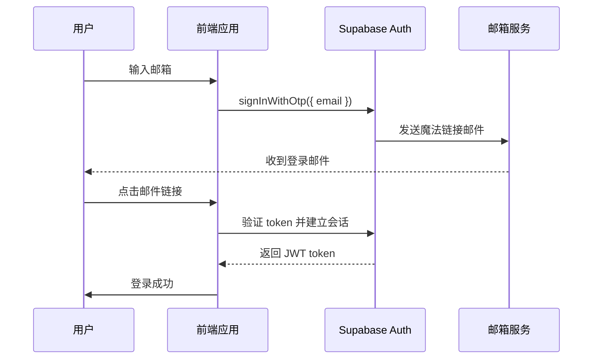

# 技术规范文档（TSD）

**项目名称**：拾光绘旅  
**文档版本**：v1.0  
**创建日期**：2026-01-21  
**面向团队**：开发团队  
**详细程度**：标准版

---

## 1. 系统架构

### 1.1 架构概览

```
┌─────────────────────────────────────────────────────────────┐
│                         前端应用                             │
│  ┌──────────────┐  ┌──────────────┐  ┌──────────────┐     │
│  │   Vue 3 SPA  │  │  Supabase JS │  │  AMap JS SDK │     │
│  │   (Vite)     │  │     SDK      │  │              │     │
│  └──────┬───────┘  └──────┬───────┘  └──────┬───────┘     │
│         │                 │                 │              │
└─────────┼─────────────────┼─────────────────┼──────────────┘
          │                 │                 │
          ▼                 ▼                 ▼
┌─────────────────────────────────────────────────────────────┐
│                         后端服务                             │
│  ┌──────────────┐  ┌──────────────┐  ┌──────────────┐     │
│  │   Node.js    │  │   Express    │  │   Supabase   │     │
│  │   Backend    │  │   Server     │  │    Client    │     │
│  └──────┬───────┘  └──────┬───────┘  └──────┬───────┘     │
│         │                 │                 │              │
│         ▼                 ▼                 ▼              │
│  ┌──────────────┐  ┌──────────────┐  ┌──────────────┐     │
│  │  AI Services │  │   LangChain  │  │    MCP       │     │
│  │              │  │   Manager    │  │    Service   │     │
│  └──────┬───────┘  └──────┬───────┘  └──────┬───────┘     │
└─────────┼─────────────────┼─────────────────┼──────────────┘
          │                 │                 │
          ▼                 ▼                 ▼
┌─────────────────────────────────────────────────────────────┐
│                     外部服务 & 存储                          │
│  ┌──────────────┐  ┌──────────────┐  ┌──────────────┐     │
│  │  DeepSeek AI │  │  高德地图 API│  │  Supabase DB │     │
│  │   (LLM)      │  │              │  │  PostgreSQL  │     │
│  └──────────────┘  └──────────────┘  └──────────────┘     │
└─────────────────────────────────────────────────────────────┘
```

### 1.2 技术栈

#### 前端技术栈
- **框架**：Vue 3.5.13 (Composition API)
- **构建工具**：Vite 6.1.0
- **路由**：Vue Router 4.5.0
- **状态管理**：Pinia 3.0.1
- **UI 组件**：自定义组件 + CSS Modules
- **HTTP 客户端**：Axios 1.8.2
- **地图服务**：高德地图 JS API
- **认证服务**：Supabase JS Client 2.47.8
- **其他**：vue-markdown-render 2.2.1, html2canvas 1.4.1

#### 后端技术栈
- **运行时**：Node.js 18+
- **框架**：Express 4.21.2
- **AI SDK**：@langchain/core 0.3.39, @langchain/community 0.3.34
- **数据库客户端**：@supabase/supabase-js 2.47.8
- **其他**：cors 2.8.5, dotenv 16.4.7, openai 4.82.0

#### 基础设施
- **数据库**：Supabase PostgreSQL
- **认证**：Supabase Auth
- **部署**：Docker + Docker Compose
- **API 网关**：Nginx（可选）

---

## 2. 数据库设计

### 2.1 数据库概览

使用 Supabase PostgreSQL 作为主数据库，采用关系型数据模型。

### 2.2 表结构设计

#### 2.2.1 用户表（users）

```sql
CREATE TABLE users (
  id UUID PRIMARY KEY DEFAULT uuid_generate_v4(),
  email VARCHAR(255) UNIQUE NOT NULL,
  created_at TIMESTAMP WITH TIME ZONE DEFAULT CURRENT_TIMESTAMP,
  updated_at TIMESTAMP WITH TIME ZONE DEFAULT CURRENT_TIMESTAMP
);

-- 索引
CREATE INDEX idx_users_email ON users(email);
```

**字段说明**：
- `id`：用户唯一标识符（UUID）
- `email`：用户邮箱，用于登录
- `created_at`：创建时间
- `updated_at`：更新时间

---

#### 2.2.2 旅行方案表（plans）

```sql
CREATE TABLE plans (
  id UUID PRIMARY KEY DEFAULT uuid_generate_v4(),
  user_id UUID NOT NULL REFERENCES users(id) ON DELETE CASCADE,
  destination VARCHAR(255) NOT NULL,
  days INTEGER NOT NULL,
  start_date DATE NOT NULL,
  budget DECIMAL(10, 2) NOT NULL,
  people_count INTEGER NOT NULL,
  preferences JSONB DEFAULT '[]'::jsonb,
  days_detail JSONB NOT NULL,
  budget_breakdown JSONB NOT NULL,
  created_at TIMESTAMP WITH TIME ZONE DEFAULT CURRENT_TIMESTAMP,
  updated_at TIMESTAMP WITH TIME ZONE DEFAULT CURRENT_TIMESTAMP
);

-- 索引
CREATE INDEX idx_plans_user_id ON plans(user_id);
CREATE INDEX idx_plans_destination ON plans(destination);
CREATE INDEX idx_plans_created_at ON plans(created_at DESC);

-- 触发器：自动更新 updated_at
CREATE OR REPLACE FUNCTION update_updated_at_column()
RETURNS TRIGGER AS $$
BEGIN
    NEW.updated_at = CURRENT_TIMESTAMP;
    RETURN NEW;
END;
$$ LANGUAGE plpgsql;

CREATE TRIGGER update_plans_updated_at
    BEFORE UPDATE ON plans
    FOR EACH ROW
    EXECUTE FUNCTION update_updated_at_column();
```

**字段说明**：
- `id`：方案唯一标识符（UUID）
- `user_id`：关联的用户 ID
- `destination`：目的地
- `days`：旅行天数
- `start_date`：出发日期
- `budget`：总预算
- `people_count`：人数
- `preferences`：偏好标签数组（JSONB）
- `days_detail`：详细行程数据（JSONB）
- `budget_breakdown`：预算分解（JSONB）

**JSONB 结构示例**：

```json
// preferences
["文化", "美食", "自然"]

// days_detail
{
  "days": [
    {
      "day": 1,
      "activities": [
        {
          "time": "上午",
          "activity": "游览岳麓山",
          "description": "岳麓山是长沙的标志性景点...",
          "cost": 0
        },
        {
          "time": "中午",
          "activity": "品尝长沙特色美食",
          "description": "推荐：臭豆腐、糖油粑粑...",
          "cost": 50
        }
      ]
    }
  ]
}

// budget_breakdown
{
  "住宿": 1200,
  "餐饮": 1000,
  "交通": 500,
  "门票": 300
}
```

---

### 2.3 数据关系图

```
┌─────────────┐       ┌─────────────┐
│    users    │ 1   N │    plans    │
├─────────────┤───────├─────────────┤
│ id (PK)     │──────▶│ id (PK)     │
│ email       │       │ user_id (FK)│
│ created_at  │       │ destination │
│ updated_at  │       │ days        │
└─────────────┘       │ start_date  │
                      │ budget      │
                      │ preferences │
                      │ days_detail │
                      │ budget_...  │
                      └─────────────┘
```

---

### 2.4 数据访问策略

#### 2.4.1 RLS（行级安全）策略

```sql
-- 启用 RLS
ALTER TABLE plans ENABLE ROW LEVEL SECURITY;

-- 策略 1：用户只能查看自己的方案
CREATE POLICY "Users can view own plans"
  ON plans FOR SELECT
  USING (auth.uid() = user_id);

-- 策略 2：用户只能插入自己的方案
CREATE POLICY "Users can insert own plans"
  ON plans FOR INSERT
  WITH CHECK (auth.uid() = user_id);

-- 策略 3：用户只能更新自己的方案
CREATE POLICY "Users can update own plans"
  ON plans FOR UPDATE
  USING (auth.uid() = user_id);

-- 策略 4：用户只能删除自己的方案
CREATE POLICY "Users can delete own plans"
  ON plans FOR DELETE
  USING (auth.uid() = user_id);
```

#### 2.4.2 数据库连接

后端使用 Supabase Client 连接数据库：

```javascript
import { createClient } from '@supabase/supabase-js';

const supabase = createClient(
  process.env.SUPABASE_URL,
  process.env.SUPABASE_ANON_KEY
);
```

---

## 3. API 接口规范

### 3.1 API 概览

| 模块 | 方法 | 路径 | 描述 |
|-----|------|------|------|
| 行程规划 | POST | /api/parse-travel-info | 解析旅行信息 |
| 行程规划 | POST | /api/plan | 生成旅行计划 |
| 行程规划 | POST | /api/complete-plan | 生成完整旅行计划 |
| AI 对话 | POST | /api/ai-chat | AI 对话 |
| AI 对话 | POST | /api/ai-chat/sessions | 创建会话 |
| AI 对话 | GET | /api/ai-chat/sessions | 获取会话列表 |
| AI 对话 | GET | /api/ai-chat/history/:id | 获取会话历史 |
| AI 对话 | DELETE | /api/ai-chat/history/:id | 删除会话 |
| AI 对话 | PATCH | /api/ai-chat/sessions/:id | 更新会话标题 |
| AI 对话 | POST | /api/tts | 语音合成任务 |
| AI 对话 | GET | /api/tts/audio/:task_id | 查询语音任务 |
| MCP | GET | /api/mcp/status | 获取 MCP 工具状态 |
| 图片生成 | GET | /api/image-providers | 获取图片提供商 |
| 图片生成 | POST | /api/generate-image | 生成图片 |
| 图片生成 | GET | /api/image-history | 获取图片生成历史 |
| 明信片 | POST | /api/generate-postcard | 生成明信片 |
| BGM 歌单 | POST | /api/generate-playlist | 生成歌单 |
| BGM 歌单 | GET | /api/playlist-history | 获取歌单生成历史 |
| 分享文案 | POST | /api/generate-share-content | 生成分享文案 |
| 提示词 | POST | /api/generate-prompt | 生成速记卡片提示词 |
| 提示词 | POST | /api/generate-postcard-prompt | 生成明信片提示词 |

### 3.2 通用规范

#### 3.2.1 请求规范

- Content-Type: `application/json`
- 认证方式：Bearer Token（Supabase JWT）
- 基础路径：`http://localhost:3002/api`
- OpenAPI 文档：`http://localhost:3002/api/docs`
- OpenAPI JSON：`http://localhost:3002/api/openapi.json`

#### 3.2.2 响应规范

成功响应：根据接口不同返回对应 JSON。

错误响应（统一格式）：
```json
{
  "message": "错误信息",
  "error": "错误信息"
}
```

---

### 3.3 详细接口文档

#### 3.3.1 行程规划接口

认证：需要

| 方法 | 路径 | 请求体 |
|------|------|-------|
| POST | /api/parse-travel-info | `{ "quickInput"?: string, "text"?: string }` |
| POST | /api/plan | 旅行规划表单 JSON |
| POST | /api/complete-plan | `{ "quickInput"?: string, "text"?: string }` |

返回：规划结果 JSON（字段随输入略有变化）。

---

#### 3.3.2 AI 对话接口

认证：需要

| 方法 | 路径 | 请求体/参数 |
|------|------|------------|
| POST | /api/ai-chat | `{ "message": string, "sessionId"?: string, "enable_tools"?: boolean, "include_audio"?: boolean, "voice"?: string, "language_type"?: string }` |
| POST | /api/ai-chat/sessions | `{ "title"?: string }` |
| GET | /api/ai-chat/sessions | 无 |
| GET | /api/ai-chat/history/:id | 路径参数 `id` |
| DELETE | /api/ai-chat/history/:id | 路径参数 `id` |
| PATCH | /api/ai-chat/sessions/:id | `{ "title": string }` |
| POST | /api/tts | `{ "text": string, "voice"?: string }` |
| GET | /api/tts/audio/:task_id | 路径参数 `task_id` |

返回：聊天/会话数据或 `{ "success": true }`，语音接口返回 `{ "taskId": string }` 或任务状态。

---

#### 3.3.3 图片生成接口

认证：`/api/image-providers` 不需要，其余需要

| 方法 | 路径 | 请求体/参数 |
|------|------|------------|
| GET | /api/image-providers | 无 |
| POST | /api/generate-image | `{ "prompt": string, "style"?: string, "size"?: string, "provider"?: string }` |
| GET | /api/image-history | 可选查询参数 `limit` |

返回：图片生成结果或历史列表。

---

#### 3.3.4 明信片接口

认证：需要

| 方法 | 路径 | 请求体 |
|------|------|-------|
| POST | /api/generate-postcard | 明信片生成参数 JSON |

返回：明信片生成结果。

---

#### 3.3.5 BGM 歌单接口

认证：需要

| 方法 | 路径 | 请求体/参数 |
|------|------|------------|
| POST | /api/generate-playlist | `{ "destination"?: string, "theme"?: string }` |
| GET | /api/playlist-history | 无 |

返回：歌单生成结果或历史列表。

---

#### 3.3.6 分享文案接口

认证：需要

| 方法 | 路径 | 请求体 |
|------|------|-------|
| POST | /api/generate-share-content | `{ "destination"?: string, "platform"?: string, "style"?: string }` |

返回：文案生成结果。

---

#### 3.3.7 提示词接口

认证：需要

| 方法 | 路径 | 请求体 |
|------|------|-------|
| POST | /api/generate-prompt | `{ "text"?: string, "scene"?: string }` |
| POST | /api/generate-postcard-prompt | `{ "text"?: string, "scene"?: string }` |

返回：提示词生成结果。

---

#### 3.3.8 MCP 接口

认证：不需要

| 方法 | 路径 | 请求体/参数 |
|------|------|------------|
| GET | /api/mcp/status | 可选查询参数 `scope` |

返回：MCP 工具状态。

---

### 3.4 错误码定义

| 错误码 | 描述 | HTTP 状态码 |
|--------|------|------------|
| `UNAUTHORIZED` | 未授权 | 401 |
| `FORBIDDEN` | 无权限 | 403 |
| `NOT_FOUND` | 资源不存在 | 404 |
| `INVALID_PARAMS` | 参数验证失败 | 400 |
| `AI_GENERATION_ERROR` | AI 生成失败 | 500 |
| `RATE_LIMIT_EXCEEDED` | 请求过于频繁 | 429 |
| `DATABASE_ERROR` | 数据库错误 | 500 |
| `INTERNAL_ERROR` | 内部错误 | 500 |

---

## 4. 认证与授权

### 4.1 认证方案

使用 **Supabase Auth** 进行用户认证，采用 **OTP（一次性密码）** 登录方式。

### 4.2 认证流程



### 4.3 前端认证实现

```javascript
import { createClient } from '@supabase/supabase-js';

const supabase = createClient(
  import.meta.env.VITE_SUPABASE_URL,
  import.meta.env.VITE_SUPABASE_ANON_KEY
);

// 发送登录链接
async function sendLoginLink(email) {
  const { data, error } = await supabase.auth.signInWithOtp({
    email: email
  });
  
  if (error) throw error;
  return data;
}

// 监听认证状态
supabase.auth.onAuthStateChange((event, session) => {
  if (session) {
    // 用户已登录
    localStorage.setItem('access_token', session.access_token);
  } else {
    // 用户已登出
    localStorage.removeItem('access_token');
  }
});

// 登出
async function logout() {
  const { error } = await supabase.auth.signOut();
  if (error) throw error;
}
```

### 4.4 后端认证验证

```javascript
import { createClient } from '@supabase/supabase-js';

const supabase = createClient(
  process.env.SUPABASE_URL,
  process.env.SUPABASE_ANON_KEY
);

// 验证 JWT token
async function verifyToken(req, res, next) {
  const authHeader = req.headers.authorization;
  
  if (!authHeader || !authHeader.startsWith('Bearer ')) {
    return res.status(401).json({ 
      success: false, 
      error: '未提供认证令牌' 
    });
  }
  
  const token = authHeader.split(' ')[1];
  
  try {
    const { data: { user }, error } = await supabase.auth.getUser(token);
    
    if (error || !user) {
      return res.status(401).json({ 
        success: false, 
        error: '无效的认证令牌' 
      });
    }
    
    req.user = user;
    next();
  } catch (error) {
    return res.status(500).json({ 
      success: false, 
      error: '认证验证失败' 
    });
  }
}

// 使用中间件
app.post('/api/plan/save', verifyToken, async (req, res) => {
  // 用户已认证，继续处理
  const userId = req.user.id;
  // ...
});
```

### 4.5 安全策略

- **Token 有效期**：访问令牌 1 小时，刷新令牌 30 天
- **自动刷新**：Supabase SDK 自动处理令牌刷新
- **HTTPS**：生产环境强制使用 HTTPS
- **敏感数据**：不在前端暴露服务端密钥

---

## 5. AI 服务集成

### 5.1 AI 服务架构

```
┌─────────────────────────────────────────┐
│           后端 AI 服务层                  │
│  ┌──────────────┐  ┌──────────────┐   │
│  │ LangChain    │  │  MCP Service │   │
│  │  Manager     │  │              │   │
│  └──────┬───────┘  └──────┬───────┘   │
└─────────┼─────────────────┼───────────┘
          │                 │
          ▼                 ▼
┌─────────────────────────────────────────┐
│         外部 AI 服务                      │
│  ┌──────────────┐  ┌──────────────┐   │
│  │  DeepSeek    │  │  OpenAI      │   │
│  │  API         │  │  API         │   │
│  └──────────────┘  └──────────────┘   │
└─────────────────────────────────────────┘
```

### 5.2 DeepSeek API 集成

#### 5.2.1 配置

```javascript
// backend/src/config/index.js
module.exports = {
  deepseek: {
    apiKey: process.env.DEEPSEEK_API_KEY,
    baseURL: 'https://api.deepseek.com/v1',
    model: 'deepseek-chat',
    maxTokens: 2000,
    temperature: 0.7
  }
};
```

#### 5.2.2 行程规划 Prompt

```javascript
const generatePlanPrompt = (params) => {
  return `
你是一个专业的旅行规划师。请根据以下信息生成详细的旅行计划：

目的地：${params.destination}
天数：${params.days}
出发日期：${params.startDate}
预算：${params.budget}元
人数：${params.peopleCount}
偏好：${params.preferences.join('、')}

请按照以下 JSON 格式返回：
{
  "destination": "目的地",
  "days": 天数,
  "days_detail": {
    "days": [
      {
        "day": 1,
        "activities": [
          {
            "time": "上午/中午/下午/晚上",
            "activity": "活动名称",
            "description": "详细描述",
            "cost": 费用
          }
        ]
      }
    ]
  },
  "total_budget": 总预算,
  "budget_breakdown": {
    "住宿": 金额,
    "餐饮": 金额,
    "交通": 金额,
    "门票": 金额
  }
}

要求：
1. 每天安排 3-4 个活动
2. 总预算控制在用户预算范围内
3. 活动要符合用户偏好
4. 景点要真实存在
`;
};
```

#### 5.2.3 调用实现

```javascript
import OpenAI from 'openai';
import config from '../config/index.js';

const deepseekClient = new OpenAI({
  apiKey: config.deepseek.apiKey,
  baseURL: config.deepseek.baseURL
});

async function generateTravelPlan(params) {
  try {
    const response = await deepseekClient.chat.completions.create({
      model: config.deepseek.model,
      messages: [
        {
          role: 'system',
          content: '你是一个专业的旅行规划师。'
        },
        {
          role: 'user',
          content: generatePlanPrompt(params)
        }
      ],
      temperature: config.deepseek.temperature,
      max_tokens: config.deepseek.maxTokens
    });

    const content = response.choices[0].message.content;
    const plan = JSON.parse(content);
    
    return { success: true, data: plan };
  } catch (error) {
    console.error('AI generation error:', error);
    return { 
      success: false, 
      error: 'AI 生成失败，请稍后重试' 
    };
  }
}
```

---

### 5.3 LangChain 集成

#### 5.3.1 工具定义

```javascript
// backend/src/services/langchain/tools/searchWeb.js
import { DynamicStructuredTool } from '@langchain/core/tools';
import { z } from 'zod';

export const searchWebTool = new DynamicStructuredTool({
  name: 'searchWeb',
  description: '搜索网络信息',
  schema: z.object({
    query: z.string().describe('搜索查询')
  }),
  func: async ({ query }) => {
    // 实现网络搜索逻辑
    return `搜索结果：${query}的相关信息...`;
  }
});

// backend/src/services/langchain/tools/searchTrainTickets.js
export const searchTrainTicketsTool = new DynamicStructuredTool({
  name: 'searchTrainTickets',
  description: '查询火车票信息',
  schema: z.object({
    from: z.string().describe('出发地'),
    to: z.string().describe('目的地'),
    date: z.string().describe('出发日期')
  }),
  func: async ({ from, to, date }) => {
    // 实现火车票查询逻辑
    return `火车票查询结果：${from} 到 ${to}，${date}`;
  }
});
```

#### 5.3.2 LangChain Manager

```javascript
// backend/src/services/langchain/LangChainManager.js
import { ChatOpenAI } from '@langchain/openai';
import { HumanMessage, SystemMessage } from '@langchain/core/messages';
import { searchWebTool, searchTrainTicketsTool } from './tools/index.js';

export class LangChainManager {
  constructor() {
    this.llm = new ChatOpenAI({
      modelName: 'deepseek-chat',
      openAIApiKey: process.env.DEEPSEEK_API_KEY,
      configuration: {
        baseURL: 'https://api.deepseek.com/v1'
      }
    });
    
    this.tools = {
      searchWeb: searchWebTool,
      searchTrainTickets: searchTrainTicketsTool
    };
  }

  async chat(messages, tools = []) {
    try {
      // 构建消息
      const langchainMessages = messages.map(msg => {
        if (msg.role === 'system') {
          return new SystemMessage(msg.content);
        }
        return new HumanMessage(msg.content);
      });

      // 调用 LLM
      const response = await this.llm.invoke(langchainMessages);
      
      return {
        content: response.content,
        tool_calls: response.tool_calls || []
      };
    } catch (error) {
      console.error('LangChain error:', error);
      throw error;
    }
  }
}
```

---

### 5.4 MCP Service

```javascript
// backend/src/services/mcpService.js
export class MCPService {
  async handleToolCall(toolName, params) {
    switch (toolName) {
      case 'searchWeb':
        return await this.searchWeb(params.query);
      
      case 'searchTrainTickets':
        return await this.searchTrainTickets(params);
      
      default:
        throw new Error(`Unknown tool: ${toolName}`);
    }
  }

  async searchWeb(query) {
    // 实现网络搜索
    return {
      results: [
        {
          title: '搜索结果 1',
          url: 'https://example.com',
          snippet: '摘要...'
        }
      ]
    };
  }

  async searchTrainTickets(params) {
    // 实现火车票查询
    return {
      from: params.from,
      to: params.to,
      date: params.date,
      tickets: [
        {
          trainNo: 'G123',
          departureTime: '09:00',
          arrivalTime: '12:00',
          price: 200
        }
      ]
    };
  }
}
```

---

## 6. 前端实现规范

### 6.1 项目结构

```
frontend/
├── src/
│   ├── components/          # 组件
│   │   ├── PlanForm.vue     # 行程表单
│   │   ├── PlanList.vue     # 方案列表
│   │   ├── PlanDetail.vue   # 方案详情
│   │   ├── MapView.vue      # 地图视图
│   │   ├── ChatBox.vue      # 对话框
│   │   ├── AuthDialog.vue   # 认证对话框
│   │   └── ...              # 其他组件
│   ├── stores/              # 状态管理
│   │   ├── planner.js       # 行程规划状态
│   │   ├── auth.js          # 认证状态
│   │   └── chat.js          # 对话状态
│   ├── router/              # 路由
│   │   └── index.js
│   ├── services/            # 服务层
│   │   ├── api.js           # API 客户端
│   │   ├── supabase.js      # Supabase 客户端
│   │   └── map.js           # 地图服务
│   ├── utils/               # 工具函数
│   │   ├── validators.js    # 验证函数
│   │   └── formatters.js    # 格式化函数
│   ├── styles/              # 样式
│   │   ├── main.css
│   │   └── variables.css
│   ├── App.vue              # 根组件
│   └── main.js              # 入口文件
├── public/                  # 静态资源
├── index.html
├── vite.config.js
└── package.json
```

---

### 6.2 状态管理（Pinia）

#### 6.2.1 认证状态

```javascript
// frontend/src/stores/auth.js
import { defineStore } from 'pinia';
import { supabase } from '../services/supabase';

export const useAuthStore = defineStore('auth', {
  state: () => ({
    user: null,
    session: null,
    loading: false,
    error: null
  }),

  getters: {
    isAuthenticated: (state) => !!state.user,
    userEmail: (state) => state.user?.email || ''
  },

  actions: {
    async initialize() {
      const { data: { session } } = await supabase.auth.getSession();
      this.session = session;
      this.user = session?.user || null;

      supabase.auth.onAuthStateChange((_event, session) => {
        this.session = session;
        this.user = session?.user || null;
      });
    },

    async sendLoginLink(email) {
      this.loading = true;
      this.error = null;

      try {
        const { error } = await supabase.auth.signInWithOtp({ email });
        if (error) throw error;
      } catch (error) {
        this.error = error.message;
        throw error;
      } finally {
        this.loading = false;
      }
    },

    async logout() {
      await supabase.auth.signOut();
      this.user = null;
      this.session = null;
    }
  }
});
```

#### 6.2.2 行程规划状态

```javascript
// frontend/src/stores/planner.js
import { defineStore } from 'pinia';
import { api } from '../services/api';

export const usePlannerStore = defineStore('planner', {
  state: () => ({
    currentPlan: null,
    savedPlans: [],
    loading: false,
    error: null
  }),

  actions: {
    async generatePlan(params) {
      this.loading = true;
      this.error = null;

      try {
        const response = await api.post('/plan/generate', params);
        this.currentPlan = response.data;
        return response.data;
      } catch (error) {
        this.error = error.message;
        throw error;
      } finally {
        this.loading = false;
      }
    },

    async savePlan(plan) {
      try {
        const response = await api.post('/plan/save', plan);
        await this.fetchPlans();
        return response.data;
      } catch (error) {
        this.error = error.message;
        throw error;
      }
    },

    async fetchPlans() {
      try {
        const response = await api.get('/plan/list');
        this.savedPlans = response.data;
      } catch (error) {
        this.error = error.message;
        throw error;
      }
    },

    async deletePlan(planId) {
      try {
        await api.delete(`/plan/${planId}`);
        this.savedPlans = this.savedPlans.filter(
          plan => plan.id !== planId
        );
      } catch (error) {
        this.error = error.message;
        throw error;
      }
    }
  }
});
```

---

### 6.3 路由配置

```javascript
// frontend/src/router/index.js
import { createRouter, createWebHistory } from 'vue-router';
import { useAuthStore } from '../stores/auth';

const routes = [
  {
    path: '/',
    name: 'Home',
    component: () => import('../views/Home.vue')
  },
  {
    path: '/planner',
    name: 'Planner',
    component: () => import('../views/Planner.vue')
  },
  {
    path: '/plan/:id',
    name: 'PlanDetail',
    component: () => import('../views/PlanDetail.vue')
  },
  {
    path: '/chat',
    name: 'Chat',
    component: () => import('../views/Chat.vue')
  }
];

const router = createRouter({
  history: createWebHistory(),
  routes
});

// 路由守卫
router.beforeEach((to, from, next) => {
  const authStore = useAuthStore();
  
  // 需要认证的路由
  const requiresAuth = ['PlanDetail'].includes(to.name);
  
  if (requiresAuth && !authStore.isAuthenticated) {
    next({ name: 'Home', query: { redirect: to.fullPath } });
  } else {
    next();
  }
});

export default router;
```

---

### 6.4 API 客户端

```javascript
// frontend/src/services/api.js
import axios from 'axios';
import { supabase } from './supabase';

const api = axios.create({
  baseURL: import.meta.env.VITE_API_BASE_URL || 'http://localhost:3000/api',
  timeout: 30000
});

// 请求拦截器
api.interceptors.request.use(
  async (config) => {
    // 自动添加认证 token
    const { data: { session } } = await supabase.auth.getSession();
    if (session?.access_token) {
      config.headers.Authorization = `Bearer ${session.access_token}`;
    }
    return config;
  },
  (error) => {
    return Promise.reject(error);
  }
);

// 响应拦截器
api.interceptors.response.use(
  (response) => response.data,
  (error) => {
    if (error.response) {
      // 处理错误响应
      const { data, status } = error.response;
      throw new Error(data.error || `请求失败 (${status})`);
    }
    throw error;
  }
);

export default api;
```

---

### 6.5 地图集成（高德地图）

```javascript
// frontend/src/services/map.js
import AMapLoader from '@amap/amap-jsapi-loader';

export class MapService {
  constructor() {
    this.map = null;
    this.markers = [];
  }

  async initMap(containerId) {
    try {
      const AMap = await AMapLoader.load({
        key: import.meta.env.VITE_AMAP_KEY,
        version: '2.0',
        plugins: ['AMap.Scale', 'AMap.ToolBar', 'AMap.ControlBar']
      });

      this.map = new AMap.Map(containerId, {
        zoom: 11,
        center: [112.938814, 28.228209], // 长沙默认坐标
        viewMode: '3D'
      });

      // 添加控件
      this.map.addControl(new AMap.Scale());
      this.map.addControl(new AMap.ToolBar());
      this.map.addControl(new AMap.ControlBar());

      return this.map;
    } catch (error) {
      console.error('地图初始化失败:', error);
      throw error;
    }
  }

  addMarkers(locations) {
    this.clearMarkers();

    locations.forEach(location => {
      const marker = new AMap.Marker({
        position: [location.longitude, location.latitude],
        title: location.name,
        icon: this.getMarkerIcon(location.type)
      });

      // 添加点击事件
      marker.on('click', () => {
        this.showInfoWindow(location);
      });

      this.markers.push(marker);
      this.map.add(marker);
    });

    // 自动调整视野
    if (this.markers.length > 0) {
      this.map.setFitView(this.markers);
    }
  }

  clearMarkers() {
    this.markers.forEach(marker => {
      this.map.remove(marker);
    });
    this.markers = [];
  }

  showInfoWindow(location) {
    const infoWindow = new AMap.InfoWindow({
      content: `
        <div style="padding: 10px;">
          <h4>${location.name}</h4>
          <p>${location.description || ''}</p>
        </div>
      `
    });

    infoWindow.open(this.map, [location.longitude, location.latitude]);
  }

  getMarkerIcon(type) {
    // 根据类型返回不同图标
    const icons = {
      '景点': '📍',
      '美食': '🍴',
      '酒店': '🏨',
      '购物': '🛍️'
    };
    return icons[type] || '📍';
  }
}

export const mapService = new MapService();
```

---

## 7. 后端实现规范

### 7.1 项目结构

```
backend/
├── src/
│   ├── config/              # 配置
│   │   └── index.js
│   ├── controllers/         # 控制器
│   │   ├── planController.js
│   │   ├── chatController.js
│   │   └── imageController.js
│   ├── routes/              # 路由
│   │   ├── index.js
│   │   ├── planRoutes.js
│   │   ├── chatRoutes.js
│   │   └── imageRoutes.js
│   ├── services/            # 服务层
│   │   ├── planService.js
│   │   ├── aiChatService.js
│   │   ├── imageService.js
│   │   ├── langchain/
│   │   │   ├── LangChainManager.js
│   │   │   └── tools/
│   │   └── mcpService.js
│   ├── middlewares/         # 中间件
│   │   ├── auth.js
│   │   └── errorHandler.js
│   ├── utils/               # 工具函数
│   │   ├── validators.js
│   │   └── formatters.js
│   └── index.js             # 入口文件
├── uploads/                 # 上传文件目录
├── .env.example
├── Dockerfile
└── package.json
```

---

### 7.2 中间件

#### 7.2.1 认证中间件

```javascript
// backend/src/middlewares/auth.js
import { createClient } from '@supabase/supabase-js';

const supabase = createClient(
  process.env.SUPABASE_URL,
  process.env.SUPABASE_ANON_KEY
);

export async function verifyToken(req, res, next) {
  const authHeader = req.headers.authorization;
  
  if (!authHeader || !authHeader.startsWith('Bearer ')) {
    return res.status(401).json({ 
      success: false, 
      error: '未提供认证令牌' 
    });
  }
  
  const token = authHeader.split(' ')[1];
  
  try {
    const { data: { user }, error } = await supabase.auth.getUser(token);
    
    if (error || !user) {
      return res.status(401).json({ 
        success: false, 
        error: '无效的认证令牌' 
      });
    }
    
    req.user = user;
    next();
  } catch (error) {
    return res.status(500).json({ 
      success: false, 
      error: '认证验证失败' 
    });
  }
}
```

#### 7.2.2 错误处理中间件

```javascript
// backend/src/middlewares/errorHandler.js

export function errorHandler(err, req, res, next) {
  console.error('Error:', err);

  if (err.name === 'ValidationError') {
    return res.status(400).json({
      success: false,
      error: err.message,
      code: 'INVALID_PARAMS'
    });
  }

  if (err.name === 'UnauthorizedError') {
    return res.status(401).json({
      success: false,
      error: '未授权',
      code: 'UNAUTHORIZED'
    });
  }

  if (err.code === '23503') { // PostgreSQL 外键约束错误
    return res.status(404).json({
      success: false,
      error: '关联资源不存在',
      code: 'NOT_FOUND'
    });
  }

  // 默认错误响应
  res.status(500).json({
    success: false,
    error: '服务器内部错误',
    code: 'INTERNAL_ERROR'
  });
}
```

---

### 7.3 控制器示例

```javascript
// backend/src/controllers/planController.js
import { planService } from '../services/planService.js';

export const planController = {
  async generate(req, res, next) {
    try {
      const params = req.body;
      const result = await planService.generate(params);
      
      res.json({
        success: true,
        data: result,
        message: '方案生成成功'
      });
    } catch (error) {
      next(error);
    }
  },

  async save(req, res, next) {
    try {
      const userId = req.user.id;
      const planData = req.body;
      const result = await planService.save(userId, planData);
      
      res.json({
        success: true,
        data: result,
        message: '保存成功'
      });
    } catch (error) {
      next(error);
    }
  },

  async list(req, res, next) {
    try {
      const userId = req.user.id;
      const plans = await planService.list(userId);
      
      res.json({
        success: true,
        data: plans,
        message: '查询成功'
      });
    } catch (error) {
      next(error);
    }
  },

  async delete(req, res, next) {
    try {
      const userId = req.user.id;
      const planId = req.params.id;
      await planService.delete(userId, planId);
      
      res.json({
        success: true,
        message: '删除成功'
      });
    } catch (error) {
      next(error);
    }
  },

  async getDetail(req, res, next) {
    try {
      const userId = req.user.id;
      const planId = req.params.id;
      const plan = await planService.getDetail(userId, planId);
      
      res.json({
        success: true,
        data: plan,
        message: '查询成功'
      });
    } catch (error) {
      next(error);
    }
  }
};
```

---

### 7.4 服务层示例

```javascript
// backend/src/services/planService.js
import { createClient } from '@supabase/supabase-js';
import { aiChatService } from './aiChatService.js';

const supabase = createClient(
  process.env.SUPABASE_URL,
  process.env.SUPABASE_SERVICE_ROLE_KEY
);

export const planService = {
  async generate(params) {
    // 调用 AI 服务生成方案
    const result = await aiChatService.generatePlan(params);
    return result;
  },

  async save(userId, planData) {
    const { data, error } = await supabase
      .from('plans')
      .insert({
        user_id: userId,
        destination: planData.destination,
        days: planData.days,
        start_date: planData.startDate,
        budget: planData.budget,
        people_count: planData.peopleCount,
        preferences: planData.preferences,
        days_detail: planData.daysDetail,
        budget_breakdown: planData.budgetBreakdown
      })
      .select()
      .single();

    if (error) throw error;
    return data;
  },

  async list(userId) {
    const { data, error } = await supabase
      .from('plans')
      .select('id, destination, days, budget, created_at')
      .eq('user_id', userId)
      .order('created_at', { ascending: false });

    if (error) throw error;
    return data;
  },

  async delete(userId, planId) {
    const { error } = await supabase
      .from('plans')
      .delete()
      .eq('id', planId)
      .eq('user_id', userId); // 确保只能删除自己的方案

    if (error) throw error;
  },

  async getDetail(userId, planId) {
    const { data, error } = await supabase
      .from('plans')
      .select('*')
      .eq('id', planId)
      .eq('user_id', userId)
      .single();

    if (error) throw error;
    return data;
  }
};
```

---

## 8. 部署规范

### 8.1 Docker 配置

#### 8.1.1 前端 Dockerfile

```dockerfile
# frontend/Dockerfile

# 构建阶段
FROM node:18-alpine AS builder

WORKDIR /app

COPY package*.json ./
RUN npm install

COPY . .
RUN npm run build

# 生产阶段
FROM nginx:alpine

COPY --from=builder /app/dist /usr/share/nginx/html
COPY nginx.conf /etc/nginx/nginx.conf

EXPOSE 80

CMD ["nginx", "-g", "daemon off;"]
```

#### 8.1.2 后端 Dockerfile

```dockerfile
# backend/Dockerfile

FROM node:18-alpine

WORKDIR /app

COPY package*.json ./
RUN npm install --production

COPY . .

RUN npm run build

EXPOSE 3000

CMD ["node", "dist/index.js"]
```

---

### 8.2 Docker Compose 配置

```yaml
version: '3.8'

services:
  frontend:
    build:
      context: ./frontend
      dockerfile: Dockerfile
    ports:
      - "80:80"
    depends_on:
      - backend
    environment:
      - VITE_API_BASE_URL=http://localhost:3000/api
      - VITE_SUPABASE_URL=${SUPABASE_URL}
      - VITE_SUPABASE_ANON_KEY=${SUPABASE_ANON_KEY}
      - VITE_AMAP_KEY=${AMAP_KEY}

  backend:
    build:
      context: ./backend
      dockerfile: Dockerfile
    ports:
      - "3000:3000"
    environment:
      - NODE_ENV=production
      - SUPABASE_URL=${SUPABASE_URL}
      - SUPABASE_ANON_KEY=${SUPABASE_ANON_KEY}
      - SUPABASE_SERVICE_ROLE_KEY=${SUPABASE_SERVICE_ROLE_KEY}
      - DEEPSEEK_API_KEY=${DEEPSEEK_API_KEY}
      - AMAP_KEY=${AMAP_KEY}
    volumes:
      - ./backend/uploads:/app/uploads
    restart: unless-stopped
```

---

### 8.3 环境变量配置

#### 后端 .env 文件

```env
# Supabase
SUPABASE_URL=https://your-project.supabase.co
SUPABASE_ANON_KEY=your-anon-key
SUPABASE_SERVICE_ROLE_KEY=your-service-role-key

# DeepSeek AI
DEEPSEEK_API_KEY=your-deepseek-api-key

# 高德地图
AMAP_KEY=your-amap-key

# 服务配置
PORT=3000
NODE_ENV=production
```

#### 前端 .env 文件

```env
VITE_API_BASE_URL=http://localhost:3000/api
VITE_SUPABASE_URL=https://your-project.supabase.co
VITE_SUPABASE_ANON_KEY=your-anon-key
VITE_AMAP_KEY=your-amap-key
```

---

### 8.4 部署流程

#### 8.4.1 本地开发

```bash
# 启动前端
cd frontend
npm install
npm run dev

# 启动后端
cd backend
npm install
npm run dev
```

#### 8.4.2 Docker 部署

```bash
# 构建并启动所有服务
docker-compose up -d

# 查看日志
docker-compose logs -f

# 停止服务
docker-compose down
```

#### 8.4.3 生产部署

1. **准备环境变量**
   ```bash
   cp .env.example .env
   # 编辑 .env 文件，填入真实的配置值
   ```

2. **构建镜像**
   ```bash
   docker-compose build
   ```

3. **启动服务**
   ```bash
   docker-compose up -d
   ```

4. **验证部署**
   ```bash
   # 检查服务状态
   docker-compose ps
   
   # 查看日志
   docker-compose logs -f backend
   docker-compose logs -f frontend
   ```

---

## 9. 测试规范

### 9.1 单元测试

```javascript
// backend/src/services/__tests__/planService.test.js
import { describe, it, expect, beforeEach, jest } from '@jest/globals';
import { planService } from '../planService';

describe('planService', () => {
  beforeEach(() => {
    // 清理测试数据
  });

  describe('generate', () => {
    it('should generate a travel plan', async () => {
      const params = {
        destination: '长沙',
        days: 5,
        startDate: '2026-02-01',
        budget: 3000,
        peopleCount: 2,
        preferences: ['文化', '美食']
      };

      const result = await planService.generate(params);

      expect(result).toBeDefined();
      expect(result.destination).toBe('长沙');
      expect(result.days).toBe(5);
      expect(result.days_detail).toBeDefined();
      expect(result.budget_breakdown).toBeDefined();
    });
  });

  describe('save', () => {
    it('should save a plan to database', async () => {
      const userId = 'test-user-id';
      const planData = {
        destination: '长沙',
        days: 5,
        startDate: '2026-02-01',
        budget: 3000,
        peopleCount: 2,
        preferences: ['文化', '美食'],
        daysDetail: {},
        budgetBreakdown: {}
      };

      const result = await planService.save(userId, planData);

      expect(result).toBeDefined();
      expect(result.id).toBeDefined();
      expect(result.user_id).toBe(userId);
    });
  });
});
```

### 9.2 集成测试

```javascript
// backend/src/routes/__tests__/planRoutes.test.js
import { describe, it, expect, beforeAll, afterAll } from '@jest/globals';
import request from 'supertest';
import { app } from '../../index';

describe('Plan Routes', () => {
  let authToken;

  beforeAll(async () => {
    // 准备测试用户和认证 token
    authToken = 'test-token';
  });

  afterAll(async () => {
    // 清理测试数据
  });

  describe('POST /api/plan/generate', () => {
    it('should generate a plan', async () => {
      const response = await request(app)
        .post('/api/plan/generate')
        .set('Authorization', `Bearer ${authToken}`)
        .send({
          destination: '长沙',
          days: 5,
          startDate: '2026-02-01',
          budget: 3000,
          peopleCount: 2,
          preferences: ['文化', '美食']
        });

      expect(response.status).toBe(200);
      expect(response.body.success).toBe(true);
      expect(response.body.data).toBeDefined();
    });
  });
});
```

---

## 10. 性能优化

### 10.1 前端优化

- **代码分割**：使用 Vue Router 的懒加载
- **资源压缩**：启用 Gzip 压缩
- **图片优化**：使用 WebP 格式，懒加载
- **缓存策略**：合理设置 HTTP 缓存头
- **CDN 加速**：静态资源使用 CDN

### 10.2 后端优化

- **数据库查询优化**：添加索引，使用连接池
- **缓存策略**：使用 Redis 缓存热点数据
- **异步处理**：耗时操作使用消息队列
- **负载均衡**：使用 Nginx 进行负载均衡

### 10.3 AI 服务优化

- **请求合并**：批量处理相似请求
- **结果缓存**：缓存 AI 生成结果
- **超时控制**：设置合理的请求超时时间
- **降级策略**：AI 服务失败时返回默认方案

---

## 11. 安全规范

### 11.1 认证安全

- 使用 HTTPS 传输
- Token 过期机制
- 敏感操作二次验证
- 登录失败次数限制

### 11.2 数据安全

- 敏感数据加密存储
- SQL 注入防护
- XSS 攻击防护
- CSRF 令牌验证

### 11.3 API 安全

- 请求频率限制
- IP 白名单（可选）
- API 密钥管理
- 日志记录和审计

---

## 12. 监控与日志

### 12.1 日志规范

```javascript
// backend/src/utils/logger.js
import winston from 'winston';

const logger = winston.createLogger({
  level: 'info',
  format: winston.format.combine(
    winston.format.timestamp(),
    winston.format.json()
  ),
  transports: [
    new winston.transports.File({ filename: 'error.log', level: 'error' }),
    new winston.transports.File({ filename: 'combined.log' })
  ]
});

if (process.env.NODE_ENV !== 'production') {
  logger.add(new winston.transports.Console({
    format: winston.format.simple()
  }));
}

export default logger;
```

### 12.2 性能监控

- API 响应时间监控
- 错误率监控
- AI 服务调用监控
- 数据库查询性能监控

### 12.3 告警机制

- API 失败率超过阈值告警
- AI 服务响应超时告警
- 数据库连接异常告警
- 服务器资源使用率告警

---

## 13. 附录

### 13.1 常见问题

**Q: 如何重置 Supabase 数据库？**
A: 在 Supabase 控制台的 SQL 编辑器中运行 `supabase-setup.sql`。

**Q: AI 生成失败如何处理？**
A: 检查 DeepSeek API Key 是否正确，查看后端日志获取详细错误信息。

**Q: 地图不显示怎么办？**
A: 确认高德地图 API Key 是否正确，检查网络连接。

### 13.2 参考资料

- [Vue 3 官方文档](https://vuejs.org/)
- [Supabase 文档](https://supabase.com/docs)
- [DeepSeek API 文档](https://platform.deepseek.com/api-docs/)
- [LangChain 文档](https://js.langchain.com/)
- [高德地图 API 文档](https://lbs.amap.com/api/javascript-api/summary)

---

**文档结束**
